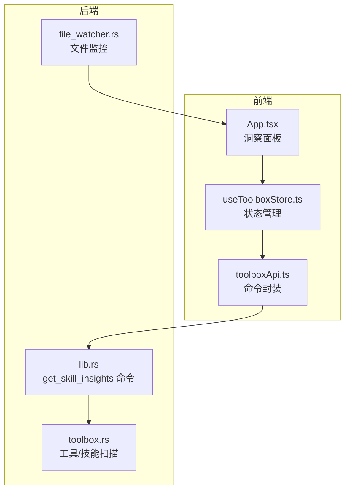
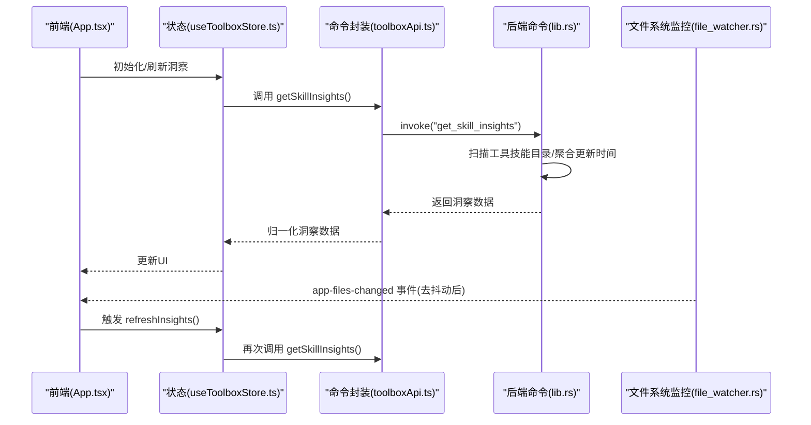
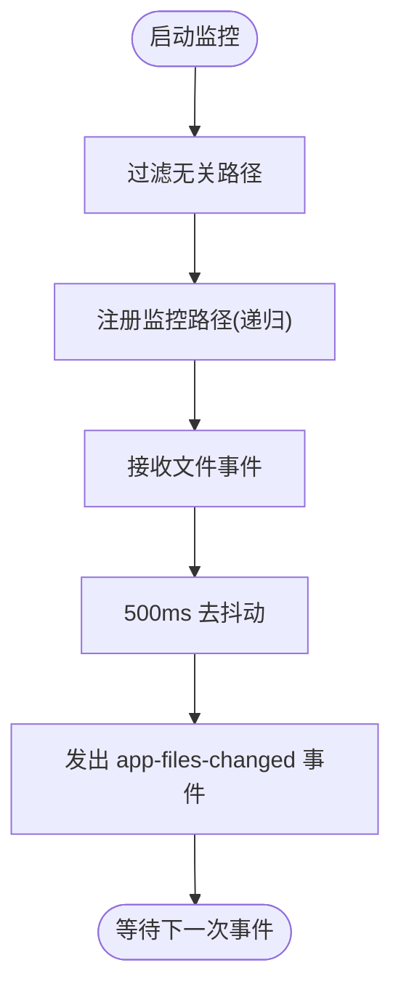
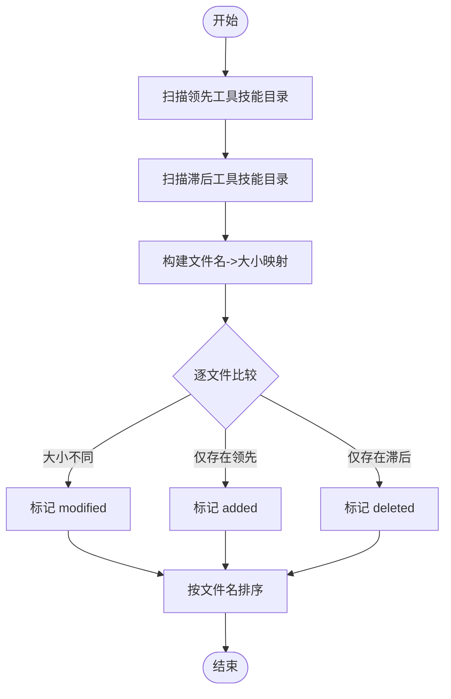
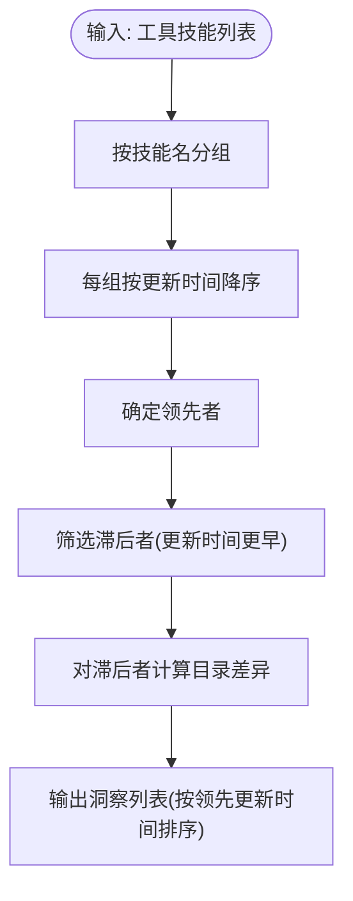
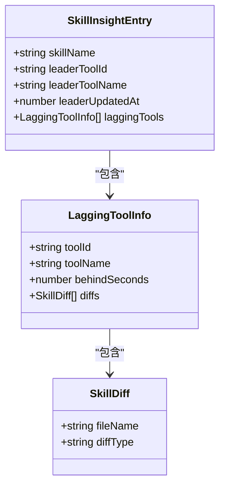
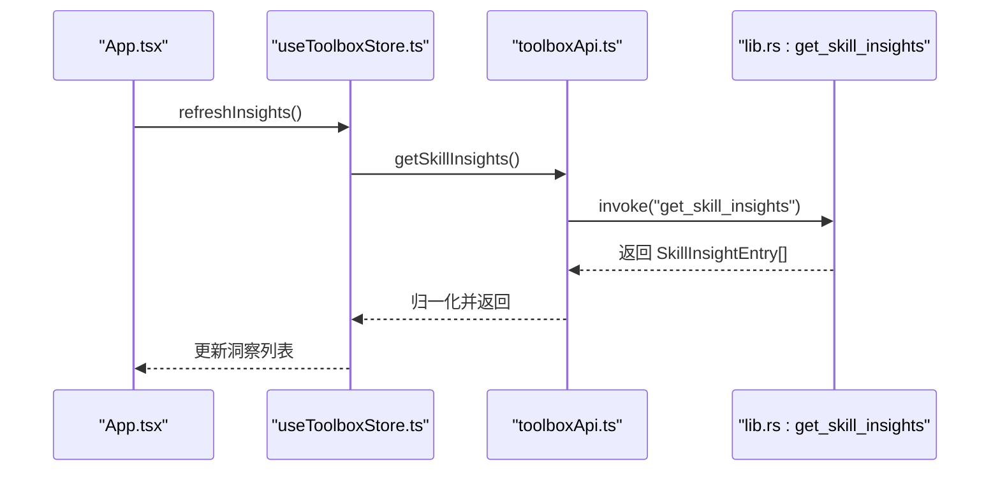
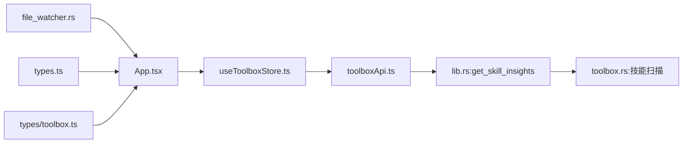

# 变动洞察

<cite>
**本文档引用的文件**
- [file_watcher.rs](file://src-tauri/src/file_watcher.rs)
- [lib.rs](file://src-tauri/src/lib.rs)
- [toolbox.rs](file://src-tauri/src/toolbox.rs)
- [App.tsx](file://src/App.tsx)
- [useToolboxStore.ts](file://src/store/useToolboxStore.ts)
- [toolboxApi.ts](file://src/lib/toolboxApi.ts)
- [types.ts](file://src/types.ts)
- [types/toolbox.ts](file://src/types/toolbox.ts)
</cite>

## 目录
1. [简介](#简介)
2. [项目结构](#项目结构)
3. [核心组件](#核心组件)
4. [架构总览](#架构总览)
5. [详细组件分析](#详细组件分析)
6. [依赖关系分析](#依赖关系分析)
7. [性能考量](#性能考量)
8. [故障排查指南](#故障排查指南)
9. [结论](#结论)
10. [附录](#附录)

## 简介
本文件为“AI工具箱”的“变动洞察”功能提供专业级技术文档。该功能通过文件系统监控与差异算法，实时追踪各工具技能目录的变更，识别领先工具与滞后工具，并提供差异对比、状态计算与可视化展示，帮助用户在多工具环境下保持技能同步的一致性。

## 项目结构
变动洞察涉及前端展示层与后端命令层的协作：
- 前端负责渲染洞察卡片、触发刷新、调用后端命令、处理用户交互。
- 后端通过命令暴露“获取技能洞察”等能力，扫描工具技能目录，计算差异并返回结构化数据。
- 文件系统监控模块负责监听技能目录变化，触发去抖动事件，供前端刷新洞察。

图表来源
- [App.tsx:1128-1361](file://src/App.tsx#L1128-L1361)
- [useToolboxStore.ts:207-217](file://src/store/useToolboxStore.ts#L207-L217)
- [toolboxApi.ts:398-405](file://src/lib/toolboxApi.ts#L398-L405)
- [lib.rs:684-755](file://src-tauri/src/lib.rs#L684-L755)
- [file_watcher.rs:21-96](file://src-tauri/src/file_watcher.rs#L21-L96)
- [toolbox.rs:428-516](file://src-tauri/src/toolbox.rs#L428-L516)

章节来源
- [App.tsx:1128-1361](file://src/App.tsx#L1128-L1361)
- [useToolboxStore.ts:207-217](file://src/store/useToolboxStore.ts#L207-L217)
- [toolboxApi.ts:398-405](file://src/lib/toolboxApi.ts#L398-L405)
- [lib.rs:684-755](file://src-tauri/src/lib.rs#L684-L755)
- [file_watcher.rs:21-96](file://src-tauri/src/file_watcher.rs#L21-L96)
- [toolbox.rs:428-516](file://src-tauri/src/toolbox.rs#L428-L516)

## 核心组件
- 文件系统监控：监听技能目录变化，过滤无关文件，进行500ms去抖动，向前端发出“文件变更”事件。
- 差异算法：基于文件名与大小的简单差异检测，输出新增、修改、删除三类差异。
- 技能洞察计算：按技能维度聚合各工具的更新时间，识别领先者与落后者，计算落后秒数与差异列表。
- 前端展示：卡片式布局展示技能名、领先工具、领先更新时间、落后工具数量与一键同步按钮。
- 命令接口：通过Tauri命令暴露“获取技能洞察”，供前端调用刷新数据。

章节来源
- [file_watcher.rs:21-96](file://src-tauri/src/file_watcher.rs#L21-L96)
- [lib.rs:630-682](file://src-tauri/src/lib.rs#L630-L682)
- [lib.rs:684-755](file://src-tauri/src/lib.rs#L684-L755)
- [App.tsx:1128-1361](file://src/App.tsx#L1128-L1361)
- [toolboxApi.ts:398-405](file://src/lib/toolboxApi.ts#L398-L405)

## 架构总览
变动洞察的端到端流程如下：
- 前端初始化时调用“获取技能洞察”命令，后端扫描工具技能目录，构建洞察数据。
- 文件系统监控在后台监听技能目录变化，触发去抖动事件，前端收到事件后再次调用命令刷新。
- 前端以卡片形式展示洞察，点击“同步”按钮打开同步对话框，选择目标工具与技能后执行同步。

图表来源
- [App.tsx:1128-1361](file://src/App.tsx#L1128-L1361)
- [useToolboxStore.ts:207-217](file://src/store/useToolboxStore.ts#L207-L217)
- [toolboxApi.ts:398-405](file://src/lib/toolboxApi.ts#L398-L405)
- [lib.rs:684-755](file://src-tauri/src/lib.rs#L684-L755)
- [file_watcher.rs:41-63](file://src-tauri/src/file_watcher.rs#L41-L63)

## 详细组件分析

### 文件系统监控
- 功能要点
  - 使用推荐的文件监控器，设置轮询间隔与内容比较策略，避免频繁读取。
  - 过滤临时文件、交换文件、备份文件及版本控制目录，减少噪音。
  - 对事件进行500ms去抖动，合并短时间内多次变更，降低刷新频率。
  - 支持动态更新监控路径列表，便于用户调整工具配置。
- 关键行为
  - 启动时注册所有监控路径，递归监听。
  - 发出“app-files-changed”事件，前端收到后可触发刷新。
- 性能影响
  - 递归监控大量目录时，应合理限制监控路径数量，避免I/O压力。
  - 去抖动参数可根据实际场景调整，平衡响应速度与CPU占用。

图表来源
- [file_watcher.rs:21-96](file://src-tauri/src/file_watcher.rs#L21-L96)

章节来源
- [file_watcher.rs:21-96](file://src-tauri/src/file_watcher.rs#L21-L96)

### 差异算法
- 算法思路
  - 遍历领先工具与滞后工具的技能目录，提取文件名与文件大小。
  - 将文件名映射为大小，比较两者的差异：新增、修改、删除。
  - 结果按文件名排序，保证输出稳定。
- 复杂度
  - 设领先/滞后目录各有 n 个文件，则时间复杂度 O(n log n)，空间复杂度 O(n)。
- 边界与限制
  - 仅基于文件名与大小，不解析文件内容，适合快速差异检测。
  - 若文件名相同但内容不同但大小相同，会被误判为未变更（概率较低）。
- 优化建议
  - 对于大文件，可引入内容哈希作为二次校验，但会增加CPU与I/O开销。
  - 对于超大目录，可分批处理或限制最大文件数。

图表来源
- [lib.rs:630-682](file://src-tauri/src/lib.rs#L630-L682)

章节来源
- [lib.rs:630-682](file://src-tauri/src/lib.rs#L630-L682)

### 技能洞察计算
- 数据聚合
  - 从已登记且启用的工具中，遍历每个技能，提取技能名与各工具的更新时间。
  - 按技能名分组，得到“技能名 -> 工具记录列表”。
- 领先者与滞后者识别
  - 对每组记录按更新时间降序排序，第一个为领先者。
  - 其余更新时间早于领先者的工具视为滞后者。
- 差异计算
  - 对每个滞后者，比较其技能目录与领先者目录，生成差异列表。
- 输出结构
  - 每个洞察项包含：技能名、领先工具信息、领先更新时间、滞后工具列表（含落后秒数与差异）。

图表来源
- [lib.rs:684-755](file://src-tauri/src/lib.rs#L684-L755)

章节来源
- [lib.rs:684-755](file://src-tauri/src/lib.rs#L684-L755)

### 前端展示与交互
- 展示内容
  - 技能名、领先工具名、领先更新时间、滞后工具数量。
  - “同步”按钮，点击后打开同步对话框，选择目标工具与技能后执行同步。
- 交互流程
  - 初始化时自动刷新洞察。
  - 用户点击“刷新”按钮手动刷新。
  - 收到“文件变更”事件后自动刷新，提升实时性。
- 数据模型
  - 技能洞察条目、滞后工具信息、差异条目等类型定义见类型文件。

图表来源
- [types/toolbox.ts:74-92](file://src/types/toolbox.ts#L74-L92)

章节来源
- [App.tsx:1128-1361](file://src/App.tsx#L1128-L1361)
- [useToolboxStore.ts:207-217](file://src/store/useToolboxStore.ts#L207-L217)
- [types/toolbox.ts:74-92](file://src/types/toolbox.ts#L74-L92)

### 命令接口与数据流
- 前端命令封装
  - 通过工具函数封装Tauri命令调用，统一响应格式与错误处理。
  - 提供“获取技能洞察”、“读取/保存配置文件”、“同步技能”等接口。
- 后端命令实现
  - 暴露“get_skill_insights”命令，执行技能洞察计算并返回结构化数据。
  - 与工具扫描、技能目录扫描等底层能力协作。
- 类型定义
  - 统一的类型定义确保前后端契约清晰，便于维护与扩展。

图表来源
- [toolboxApi.ts:398-405](file://src/lib/toolboxApi.ts#L398-L405)
- [lib.rs:684-755](file://src-tauri/src/lib.rs#L684-L755)
- [useToolboxStore.ts:207-217](file://src/store/useToolboxStore.ts#L207-L217)

章节来源
- [toolboxApi.ts:398-405](file://src/lib/toolboxApi.ts#L398-L405)
- [lib.rs:684-755](file://src-tauri/src/lib.rs#L684-L755)
- [useToolboxStore.ts:207-217](file://src/store/useToolboxStore.ts#L207-L217)

## 依赖关系分析
- 前端依赖
  - App.tsx 依赖 useToolboxStore.ts 管理状态，依赖 toolboxApi.ts 调用后端命令。
  - 类型定义来自 types.ts 与 types/toolbox.ts，确保数据结构一致性。
- 后端依赖
  - lib.rs 依赖工具扫描与技能扫描能力，组合差异计算与洞察聚合。
  - file_watcher.rs 为外部事件源，驱动前端刷新。
- 耦合与内聚
  - 前后端通过Tauri命令解耦，职责清晰。
  - 差异算法与洞察计算集中在后端，前端专注展示与交互。

图表来源
- [App.tsx:1128-1361](file://src/App.tsx#L1128-L1361)
- [useToolboxStore.ts:207-217](file://src/store/useToolboxStore.ts#L207-L217)
- [toolboxApi.ts:398-405](file://src/lib/toolboxApi.ts#L398-L405)
- [lib.rs:684-755](file://src-tauri/src/lib.rs#L684-L755)
- [file_watcher.rs:21-96](file://src-tauri/src/file_watcher.rs#L21-L96)
- [toolbox.rs:428-516](file://src-tauri/src/toolbox.rs#L428-L516)
- [types.ts:1-38](file://src/types.ts#L1-L38)
- [types/toolbox.ts:74-92](file://src/types/toolbox.ts#L74-L92)

章节来源
- [App.tsx:1128-1361](file://src/App.tsx#L1128-L1361)
- [useToolboxStore.ts:207-217](file://src/store/useToolboxStore.ts#L207-L217)
- [toolboxApi.ts:398-405](file://src/lib/toolboxApi.ts#L398-L405)
- [lib.rs:684-755](file://src-tauri/src/lib.rs#L684-L755)
- [file_watcher.rs:21-96](file://src-tauri/src/file_watcher.rs#L21-L96)
- [toolbox.rs:428-516](file://src-tauri/src/toolbox.rs#L428-L516)
- [types.ts:1-38](file://src/types.ts#L1-L38)
- [types/toolbox.ts:74-92](file://src/types/toolbox.ts#L74-L92)

## 性能考量
- 文件系统监控
  - 合理设置轮询间隔与内容比较策略，避免频繁I/O。
  - 过滤无关路径，减少事件噪声；去抖动参数根据场景权衡。
- 差异算法
  - 基于文件名与大小的差异检测时间复杂度为 O(n log n)，适合大多数场景。
  - 对超大目录可考虑分批处理或限制最大文件数。
- 洞察计算
  - 按技能分组聚合，时间复杂度 O(S·T log T)，其中 S 为技能数，T 为工具数。
  - 对每个滞后者单独计算差异，注意控制并发与资源上限。
- 前端渲染
  - 使用虚拟滚动与懒加载，避免一次性渲染大量卡片。
  - 对“刷新”按钮添加防抖，避免频繁请求导致卡顿。

[本节为通用性能指导，不直接分析具体文件，故无章节来源]

## 故障排查指南
- 无法获取洞察
  - 检查工具是否启用、技能目录是否存在。
  - 查看后端命令返回的错误信息，确认路径与权限。
- 刷新无效
  - 确认文件监控已启动且路径正确。
  - 检查前端是否收到“app-files-changed”事件并触发刷新。
- 差异不准确
  - 确认文件名与大小是否发生变化。
  - 如需更精确的差异检测，可考虑引入内容哈希校验。
- 同步失败
  - 检查冲突策略与目标路径权限。
  - 确认目标工具的技能目录存在且可写。

章节来源
- [file_watcher.rs:21-96](file://src-tauri/src/file_watcher.rs#L21-L96)
- [lib.rs:684-755](file://src-tauri/src/lib.rs#L684-L755)
- [toolboxApi.ts:438-465](file://src/lib/toolboxApi.ts#L438-L465)

## 结论
变动洞察通过文件系统监控与差异算法，实现了对多工具技能目录的实时追踪与可视化展示。其命令化接口与清晰的类型定义，使得前后端协作高效可靠。在性能方面，采用去抖动、分组聚合与简单差异检测等策略，在准确性与效率之间取得良好平衡。对于大规模工具管理场景，建议结合路径过滤、分批处理与缓存策略进一步优化。

[本节为总结性内容，不直接分析具体文件，故无章节来源]

## 附录

### API 接口清单（变动洞察相关）
- 获取技能洞察
  - 方法：invoke("get_skill_insights")
  - 参数：无
  - 返回：SkillInsightEntry[]
  - 用途：刷新洞察面板数据
- 刷新洞察（前端）
  - 方法：refreshInsights()
  - 用途：触发后端重新计算并更新UI
- 文件变更事件
  - 事件：app-files-changed
  - 用途：收到事件后触发 refreshInsights()

章节来源
- [toolboxApi.ts:398-405](file://src/lib/toolboxApi.ts#L398-L405)
- [useToolboxStore.ts:207-217](file://src/store/useToolboxStore.ts#L207-L217)
- [file_watcher.rs:41-63](file://src-tauri/src/file_watcher.rs#L41-L63)