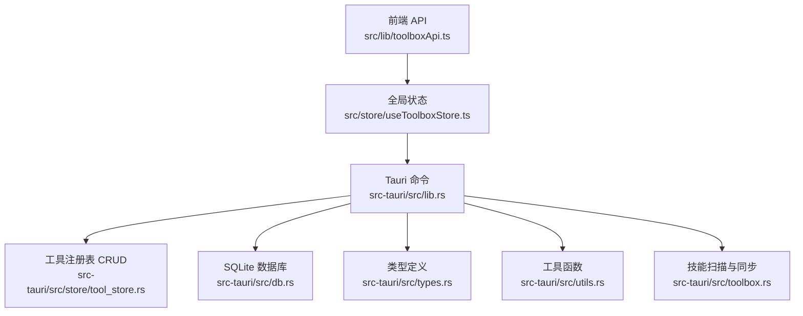
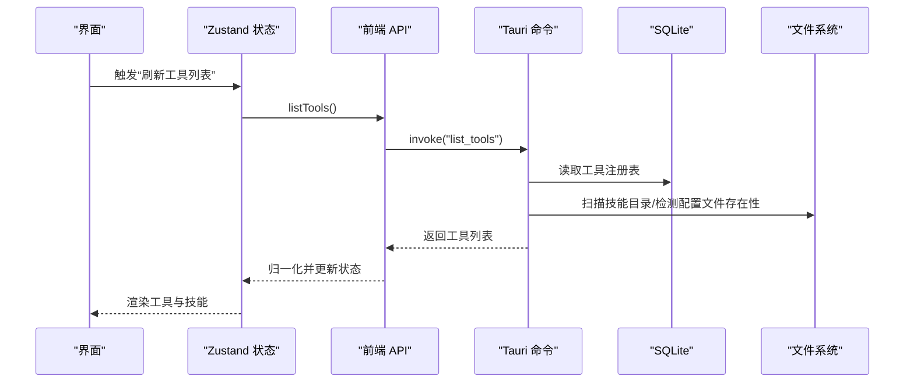
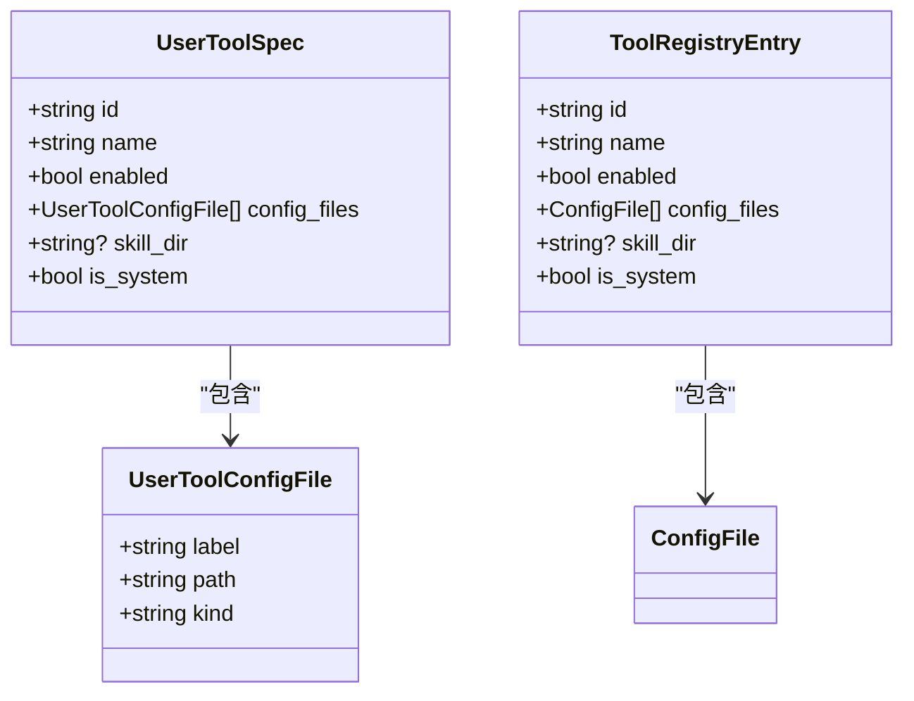
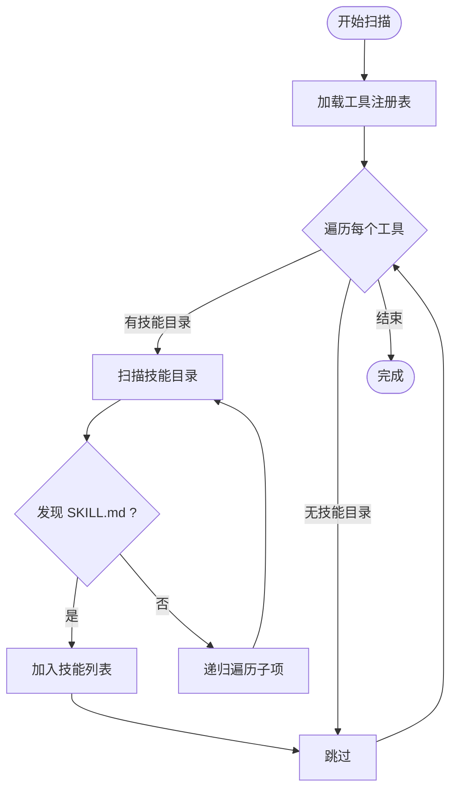
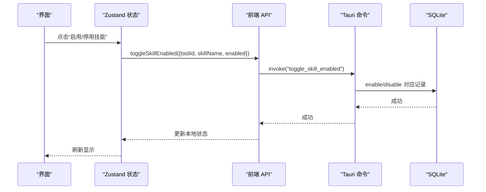
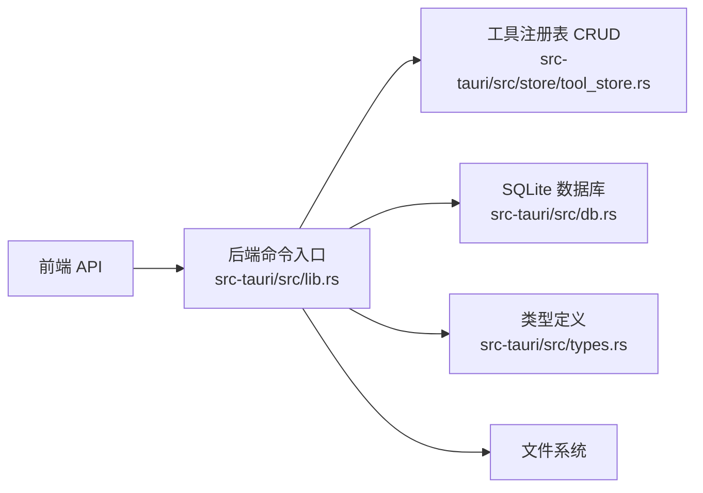

# 工具管理

<cite>
**本文引用的文件**
- [src/lib/toolboxApi.ts](file://src/lib/toolboxApi.ts)
- [src/store/useToolboxStore.ts](file://src/store/useToolboxStore.ts)
- [src/types/toolbox.ts](file://src/types/toolbox.ts)
- [src-tauri/src/lib.rs](file://src-tauri/src/lib.rs)
- [src-tauri/src/toolbox.rs](file://src-tauri/src/toolbox.rs)
- [src-tauri/src/store/tool_store.rs](file://src-tauri/src/store/tool_store.rs)
- [src-tauri/src/types.rs](file://src-tauri/src/types.rs)
- [src-tauri/src/db.rs](file://src-tauri/src/db.rs)
- [src-tauri/src/utils.rs](file://src-tauri/src/utils.rs)
</cite>

## 目录
1. [简介](#简介)
2. [项目结构](#项目结构)
3. [核心组件](#核心组件)
4. [架构总览](#架构总览)
5. [详细组件分析](#详细组件分析)
6. [依赖关系分析](#依赖关系分析)
7. [性能考量](#性能考量)
8. [故障排查指南](#故障排查指南)
9. [结论](#结论)
10. [附录](#附录)

## 简介
本章节聚焦于 AI 工具箱的“工具管理”能力，涵盖多工具注册与管理机制、自动扫描工具目录与技能目录、配置文件识别、工具启用/禁用切换、工具状态数据结构与持久化、以及常见问题排查。文档同时给出前端 API 调用方式与后端命令实现的映射关系，帮助开发者快速定位问题与扩展功能。

## 项目结构
工具管理相关代码主要分布在以下位置：
- 前端
  - API 封装与类型定义：src/lib/toolboxApi.ts、src/types/toolbox.ts
  - 全局状态与交互逻辑：src/store/useToolboxStore.ts
- 后端（Rust）
  - 命令入口与工具注册表：src-tauri/src/lib.rs
  - 工具扫描与技能目录遍历：src-tauri/src/toolbox.rs
  - 用户工具注册表 CRUD：src-tauri/src/store/tool_store.rs
  - 类型定义与请求/响应模型：src-tauri/src/types.rs
  - 数据库与技能停用状态：src-tauri/src/db.rs
  - 工具路径探测：src-tauri/src/store/tool_store.rs（detect_tool_paths）
  - 主目录工具默认配置：src-tauri/src/lib.rs（default_tool_specs）

图表来源
- [src/lib/toolboxApi.ts:1-784](file://src/lib/toolboxApi.ts#L1-L784)
- [src/store/useToolboxStore.ts:1-556](file://src/store/useToolboxStore.ts#L1-L556)
- [src-tauri/src/lib.rs:1-800](file://src-tauri/src/lib.rs#L1-L800)
- [src-tauri/src/store/tool_store.rs:1-380](file://src-tauri/src/store/tool_store.rs#L1-L380)
- [src-tauri/src/db.rs:1-222](file://src-tauri/src/db.rs#L1-L222)
- [src-tauri/src/toolbox.rs:1-800](file://src-tauri/src/toolbox.rs#L1-L800)
- [src-tauri/src/types.rs:1-367](file://src-tauri/src/types.rs#L1-L367)
- [src-tauri/src/utils.rs:1-12](file://src-tauri/src/utils.rs#L1-L12)

章节来源
- [src/lib/toolboxApi.ts:1-784](file://src/lib/toolboxApi.ts#L1-L784)
- [src/store/useToolboxStore.ts:1-556](file://src/store/useToolboxStore.ts#L1-L556)
- [src-tauri/src/lib.rs:1-800](file://src-tauri/src/lib.rs#L1-L800)
- [src-tauri/src/store/tool_store.rs:1-380](file://src-tauri/src/store/tool_store.rs#L1-L380)
- [src-tauri/src/db.rs:1-222](file://src-tauri/src/db.rs#L1-L222)
- [src-tauri/src/toolbox.rs:1-800](file://src-tauri/src/toolbox.rs#L1-L800)
- [src-tauri/src/types.rs:1-367](file://src-tauri/src/types.rs#L1-L367)
- [src-tauri/src/utils.rs:1-12](file://src-tauri/src/utils.rs#L1-L12)

## 核心组件
- 前端 API 封装：提供 listTools、listToolRegistry、upsertToolRegistryItem、deleteToolRegistryItem、detectToolPaths、toggleSkillEnabled、syncSkills 等方法，统一处理响应归一化与错误反馈。
- 全局状态管理：useToolboxStore 维护工具列表、选中项、配置文件内容、同步状态、反馈信息等，并封装用户操作流程。
- 后端命令层：通过 #[tauri::command] 注解暴露 Rust 函数，负责工具注册表读写、技能目录扫描、配置文件读写、冲突策略与同步模式执行。
- 数据持久化：SQLite 存储工具注册表、工具配置文件、技能标签、预设、同步记录、技能停用状态等。
- 工具路径探测：根据工具名或 ID 关键字匹配，自动探测配置文件与技能目录是否存在。

章节来源
- [src/lib/toolboxApi.ts:387-580](file://src/lib/toolboxApi.ts#L387-L580)
- [src/store/useToolboxStore.ts:145-555](file://src/store/useToolboxStore.ts#L145-L555)
- [src-tauri/src/lib.rs:620-800](file://src-tauri/src/lib.rs#L620-L800)
- [src-tauri/src/db.rs:59-147](file://src-tauri/src/db.rs#L59-L147)
- [src-tauri/src/store/tool_store.rs:274-380](file://src-tauri/src/store/tool_store.rs#L274-L380)

## 架构总览
前端通过 invoke 调用后端命令，后端命令根据请求参数执行相应逻辑（读取/写入配置文件、扫描技能目录、同步技能、增删改工具注册表、查询数据库等），并将结果以结构化数据返回给前端。

图表来源
- [src/lib/toolboxApi.ts:387-396](file://src/lib/toolboxApi.ts#L387-L396)
- [src-tauri/src/lib.rs:620-628](file://src-tauri/src/lib.rs#L620-L628)
- [src-tauri/src/db.rs:11-127](file://src-tauri/src/db.rs#L11-L127)
- [src-tauri/src/toolbox.rs:428-450](file://src-tauri/src/toolbox.rs#L428-L450)

## 详细组件分析

### 多工具注册与管理机制
- 默认工具集：根据操作系统平台生成默认工具规格（含配置文件与技能目录），并写入用户主目录下的注册文件。
- 用户工具注册表：支持增删改查用户自定义工具，每个工具可配置多个配置文件与技能目录，且支持启用/禁用。
- 工具启用/禁用：通过 upsertToolRegistryItem 更新 enabled 字段；后端 list_tools 仅返回 enabled=true 的工具。

图表来源
- [src-tauri/src/types.rs:123-151](file://src-tauri/src/types.rs#L123-L151)
- [src-tauri/src/lib.rs:205-249](file://src-tauri/src/lib.rs#L205-L249)

章节来源
- [src-tauri/src/lib.rs:28-184](file://src-tauri/src/lib.rs#L28-L184)
- [src-tauri/src/lib.rs:757-780](file://src-tauri/src/lib.rs#L757-L780)
- [src-tauri/src/store/tool_store.rs:11-127](file://src-tauri/src/store/tool_store.rs#L11-L127)

### 自动扫描工具目录与技能目录
- 工具扫描：list_tools 会加载用户注册表，对每个工具的配置文件存在性进行检测，并扫描技能目录，统计技能数量与技能条目（含链接目标、描述、更新时间等）。
- 技能扫描算法：递归遍历技能根目录，遇到 SKILL.md 即认定为技能目录，去重符号链接循环，收集技能元信息。
- 冲突策略与同步模式：支持 copy 与 symlink 两种同步模式，以及 skip/overwrite/rename 三种冲突策略。

图表来源
- [src-tauri/src/toolbox.rs:428-516](file://src-tauri/src/toolbox.rs#L428-L516)
- [src-tauri/src/lib.rs:450-517](file://src-tauri/src/lib.rs#L450-L517)

章节来源
- [src-tauri/src/toolbox.rs:219-224](file://src-tauri/src/toolbox.rs#L219-L224)
- [src-tauri/src/toolbox.rs:297-400](file://src-tauri/src/toolbox.rs#L297-L400)
- [src-tauri/src/toolbox.rs:428-516](file://src-tauri/src/toolbox.rs#L428-L516)

### 工具启用/禁用切换与用户操作流程
- 前端：toggleSkillEnabled 调用后端命令，成功后前端立即更新对应工具的技能 enabled 状态。
- 后端：toggle_skill_enabled 命令委托数据库层更新 skill_disabled 表，实现技能停用/启用。
- 状态持久化：数据库表 skill_disabled 记录停用的工具与技能组合，scan_skill_dir 时读取并设置 enabled 字段。

图表来源
- [src/lib/toolboxApi.ts:606-612](file://src/lib/toolboxApi.ts#L606-L612)
- [src/store/useToolboxStore.ts:386-410](file://src/store/useToolboxStore.ts#L386-L410)
- [src-tauri/src/db.rs:175-197](file://src-tauri/src/db.rs#L175-L197)

章节来源
- [src/lib/toolboxApi.ts:606-612](file://src/lib/toolboxApi.ts#L606-L612)
- [src/store/useToolboxStore.ts:386-410](file://src/store/useToolboxStore.ts#L386-L410)
- [src-tauri/src/db.rs:150-197](file://src-tauri/src/db.rs#L150-L197)

### 工具状态数据结构与持久化机制
- 工具注册表：tools 表存储 id/name/enabled/skill_dir/is_system 等；tool_configs 表存储每个工具的配置文件（label/path/kind）。
- 技能停用状态：skill_disabled 表存储 tool_id 与 skill_name 的组合，用于控制技能启用/停用。
- 预设与标签：presets/preset_skills/skill_tags 等表支撑预设与标签管理。
- 文件与备份：配置文件写入前会创建备份，备份文件名包含时间戳。

章节来源
- [src-tauri/src/types.rs:59-158](file://src-tauri/src/types.rs#L59-L158)
- [src-tauri/src/db.rs:59-147](file://src-tauri/src/db.rs#L59-L147)
- [src-tauri/src/db.rs:175-197](file://src-tauri/src/db.rs#L175-L197)

### 工具注册 API 调用方式与参数说明
- 列出工具：listTools → 后端 list_tools
  - 参数：无
  - 返回：ToolEntry[]（包含 id/name/config_files/skill_dir/skills/enabled）
- 列出工具注册表：listToolRegistry → 后端 list_tool_registry
  - 参数：无
  - 返回：ToolRegistryEntry[]（包含 id/name/enabled/config_files/skill_dir）
- 新增/更新工具注册项：upsertToolRegistryItem → 后端 upsert_tool_registry_item
  - 请求体：UpsertToolRequest（id/name/enabled/config_files/skill_dir）
  - 返回：ToolRegistryEntry
- 删除工具注册项：deleteToolRegistryItem → 后端 delete_tool_registry_item
  - 请求体：DeleteToolRequest（id）
  - 返回：消息字符串
- 探测工具路径：detectToolPaths → 后端 detect_tool_paths
  - 请求体：DetectToolPathsRequest（id/name）
  - 返回：DetectToolPathsResult（config_files/skill_dir）
- 切换技能启用状态：toggleSkillEnabled → 后端 toggle_skill_enabled
  - 请求体：ToggleSkillEnabledRequest（toolId/skillName/enabled）
  - 返回：无（void）

章节来源
- [src/lib/toolboxApi.ts:521-580](file://src/lib/toolboxApi.ts#L521-L580)
- [src-tauri/src/lib.rs:757-800](file://src-tauri/src/lib.rs#L757-L800)
- [src-tauri/src/types.rs:238-257](file://src-tauri/src/types.rs#L238-L257)

### 支持的工具与配置文件
- Codex：配置文件 .codex/config.toml；技能目录 .agents/skills
- Claude：配置文件 .claude/settings.json；技能目录 .claude/skills
- Cursor：配置文件 settings.json、mcp.json、hooks.json；技能目录 .cursor/skills-cursor
- Qoder：配置文件 settings.json；技能目录 .qoder/skills
- Trae：配置文件 settings.json、skill-config.json；技能目录 .trae-cn/skills
- OpenCode：配置文件 opencode.jsonc、config.json；技能目录 .config/opencode/skills
- Agents Skills：仅技能目录 .agents/skills

章节来源
- [src-tauri/src/lib.rs:28-184](file://src-tauri/src/lib.rs#L28-L184)
- [src-tauri/src/store/tool_store.rs:274-380](file://src-tauri/src/store/tool_store.rs#L274-L380)
- [src-tauri/src/toolbox.rs:132-216](file://src-tauri/src/toolbox.rs#L132-L216)

## 依赖关系分析
- 前端依赖后端命令：所有工具管理操作均通过 invoke 调用后端命令。
- 后端依赖数据库：工具注册表、配置文件、技能停用状态、预设、标签等均持久化至 SQLite。
- 文件系统依赖：读取/写入配置文件、扫描技能目录、创建备份、符号链接等。

图表来源
- [src/lib/toolboxApi.ts:1-20](file://src/lib/toolboxApi.ts#L1-L20)
- [src-tauri/src/lib.rs:1-20](file://src-tauri/src/lib.rs#L1-L20)
- [src-tauri/src/store/tool_store.rs:1-10](file://src-tauri/src/store/tool_store.rs#L1-L10)
- [src-tauri/src/db.rs:1-10](file://src-tauri/src/db.rs#L1-L10)
- [src-tauri/src/types.rs:1-10](file://src-tauri/src/types.rs#L1-L10)

章节来源
- [src/lib/toolboxApi.ts:1-20](file://src/lib/toolboxApi.ts#L1-L20)
- [src-tauri/src/lib.rs:1-20](file://src-tauri/src/lib.rs#L1-L20)
- [src-tauri/src/store/tool_store.rs:1-10](file://src-tauri/src/store/tool_store.rs#L1-L10)
- [src-tauri/src/db.rs:1-10](file://src-tauri/src/db.rs#L1-L10)
- [src-tauri/src/types.rs:1-10](file://src-tauri/src/types.rs#L1-L10)

## 性能考量
- 技能扫描：使用 BTreeMap 去重与排序，避免重复处理同一技能目录；符号链接采用 canonicalize 去重，防止无限递归。
- 同步策略：copy 模式会完整复制文件树，适合需要独立副本的场景；symlink 模式更节省空间但受平台与权限限制。
- 冲突处理：重命名策略通过时间戳追加后缀，确保不覆盖原文件。
- 数据库事务：批量写入工具注册表时使用事务，减少磁盘写入次数，提升稳定性。

章节来源
- [src-tauri/src/toolbox.rs:428-516](file://src-tauri/src/toolbox.rs#L428-L516)
- [src-tauri/src/toolbox.rs:632-743](file://src-tauri/src/toolbox.rs#L632-L743)
- [src-tauri/src/store/tool_store.rs:88-127](file://src-tauri/src/store/tool_store.rs#L88-L127)

## 故障排查指南
- 工具路径识别失败
  - 现象：detectToolPaths 返回空结果或技能目录为空
  - 排查要点：确认工具名关键字是否正确（大小写不敏感）；检查主目录拼接是否正确；确认目标路径是否存在
  - 参考实现：detect_tool_paths
- 配置文件解析错误
  - 现象：读取配置文件报错或内容为空
  - 排查要点：确认配置文件路径是否在注册表中；确认文件存在且可读；检查文件编码与格式
  - 参考实现：read_config_file/read_config_file_by_path
- 技能同步失败
  - 现象：同步后目标工具未更新
  - 排查要点：确认源/目标工具不同；确认技能目录存在；检查冲突策略与同步模式；查看返回的操作明细
  - 参考实现：sync_skills
- 技能停用/启用异常
  - 现象：切换后状态未生效
  - 排查要点：确认数据库中 skill_disabled 记录是否正确；确认 scan_skill_dir 是否读取到停用列表
  - 参考实现：enable_skill/disable_skill/list_disabled_skills
- 数据库初始化失败
  - 现象：提示数据库未初始化或表结构缺失
  - 排查要点：确认 ~/.ai-toolbox 目录存在且可写；确认 init_db_pool 已调用；检查迁移脚本是否执行
  - 参考实现：init_db_pool/get_db

章节来源
- [src-tauri/src/store/tool_store.rs:274-380](file://src-tauri/src/store/tool_store.rs#L274-L380)
- [src-tauri/src/lib.rs:245-249](file://src-tauri/src/lib.rs#L245-L249)
- [src-tauri/src/toolbox.rs:226-295](file://src-tauri/src/toolbox.rs#L226-L295)
- [src-tauri/src/db.rs:150-208](file://src-tauri/src/db.rs#L150-L208)
- [src-tauri/src/db.rs:212-222](file://src-tauri/src/db.rs#L212-L222)

## 结论
工具管理模块通过前后端协同，实现了多工具注册、自动扫描、配置文件识别、技能目录遍历、启用/禁用切换与持久化等功能。前端 API 提供统一调用入口与响应归一化，后端命令负责具体业务逻辑与数据持久化。遵循本文档的调用方式与排查步骤，可高效完成工具管理的开发与维护。

## 附录
- 常用 API 快速参考
  - 列出工具：listTools → list_tools
  - 列出注册表：listToolRegistry → list_tool_registry
  - 新增/更新：upsertToolRegistryItem → upsert_tool_registry_item
  - 删除：deleteToolRegistryItem → delete_tool_registry_item
  - 探测路径：detectToolPaths → detect_tool_paths
  - 切换技能：toggleSkillEnabled → toggle_skill_enabled
  - 同步技能：syncSkills → sync_skills

章节来源
- [src/lib/toolboxApi.ts:387-580](file://src/lib/toolboxApi.ts#L387-L580)
- [src-tauri/src/lib.rs:620-800](file://src-tauri/src/lib.rs#L620-L800)