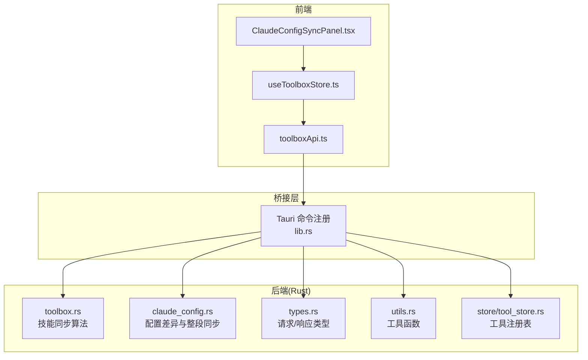
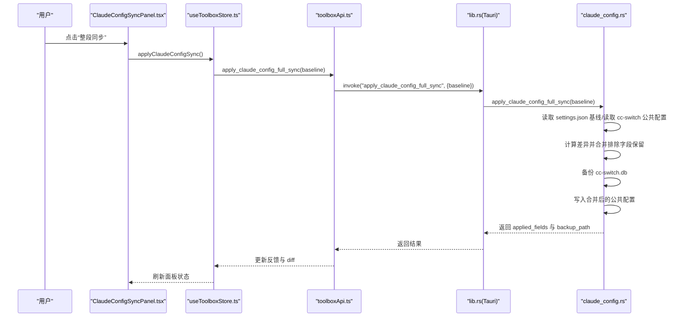
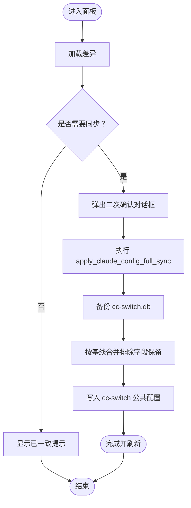
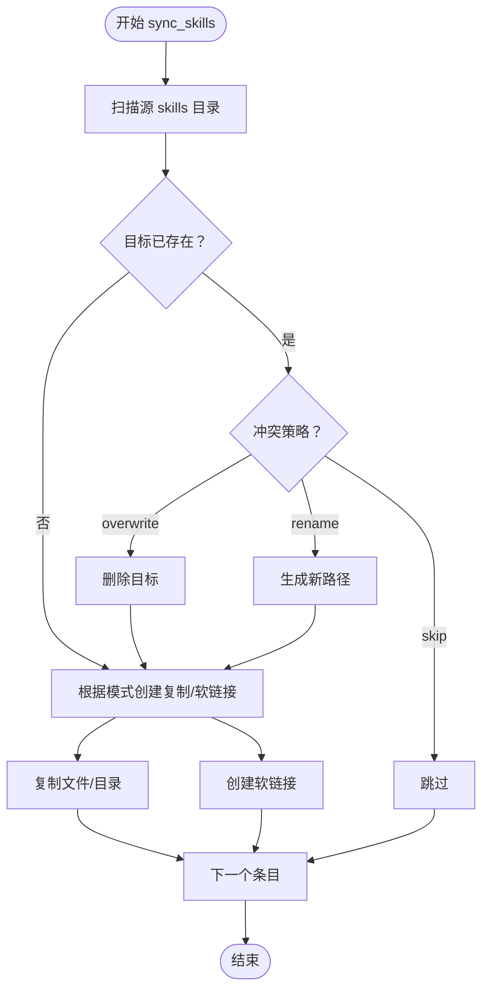
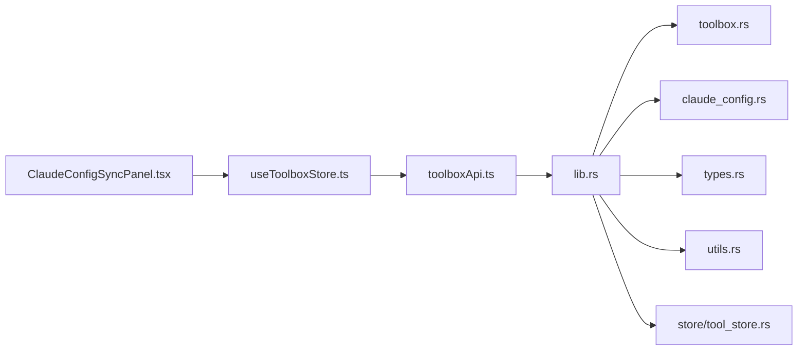

# 技能同步

<cite>
**本文引用的文件**
- [ClaudeConfigSyncPanel.tsx](file://src/components/ClaudeConfigSyncPanel.tsx)
- [toolboxApi.ts](file://src/lib/toolboxApi.ts)
- [useToolboxStore.ts](file://src/store/useToolboxStore.ts)
- [toolbox.ts](file://src-tauri/src/toolbox.rs)
- [claude_config.rs](file://src-tauri/src/claude_config.rs)
- [types.ts](file://src-tauri/src/types.rs)
- [lib.rs](file://src-tauri/src/lib.rs)
- [utils.rs](file://src-tauri/src/utils.rs)
- [store/tool_store.rs](file://src-tauri/src/store/tool_store.rs)
- [main.rs](file://src-tauri/src/main.rs)
</cite>

## 目录
1. [简介](#简介)
2. [项目结构](#项目结构)
3. [核心组件](#核心组件)
4. [架构总览](#架构总览)
5. [详细组件分析](#详细组件分析)
6. [依赖关系分析](#依赖关系分析)
7. [性能考量](#性能考量)
8. [故障排查指南](#故障排查指南)
9. [结论](#结论)
10. [附录](#附录)

## 简介
本文件围绕 AI 工具箱的“技能同步”能力进行技术文档化，重点覆盖以下方面：
- 一键同步技能到多个目标工具的实现机制与流程
- 同步算法核心逻辑与性能优化策略
- 软链接与物理复制两种同步模式的技术差异与适用场景
- 冲突处理策略（跳过、覆盖、重命名）的决策逻辑与实现细节
- 实时同步状态显示的技术架构与用户反馈设计
- API 调用示例与参数配置说明
- 同步过程中的错误处理与异常恢复机制
- 同步性能优化最佳实践与常见问题解决方案

## 项目结构
前端通过 Tauri 桥接到 Rust 后端，形成“React + Zustand + Tauri + Rust”的分层架构。技能同步涉及两类场景：
- 面向“工具配置”的同步（以 Claude 为例），由前端面板驱动，后端负责计算差异与执行整段同步
- 面向“技能文件”的同步（Codex/Claude/Cursor 等工具的 skills 目录），由后端统一实现复制/软链接与冲突处理

图表来源
- [lib.rs:1-800](file://src-tauri/src/lib.rs#L1-L800)
- [toolbox.rs:1-800](file://src-tauri/src/toolbox.rs#L1-L800)
- [claude_config.rs:1-523](file://src-tauri/src/claude_config.rs#L1-L523)
- [toolboxApi.ts:1-784](file://src/lib/toolboxApi.ts#L1-L784)
- [useToolboxStore.ts:1-556](file://src/store/useToolboxStore.ts#L1-L556)

章节来源
- [lib.rs:1-800](file://src-tauri/src/lib.rs#L1-L800)
- [toolboxApi.ts:1-784](file://src/lib/toolboxApi.ts#L1-L784)
- [useToolboxStore.ts:1-556](file://src/store/useToolboxStore.ts#L1-L556)

## 核心组件
- 前端面板与状态管理
  - Claude 配置同步面板：负责展示差异、基线选择、触发整段同步与二次确认
  - Zustand 状态：维护同步模式、冲突策略、加载状态、反馈信息
  - API 封装：统一调用 Tauri 命令，屏蔽前端/后端边界
- 后端命令与算法
  - 技能同步：遍历源工具 skills 目录，按模式复制或创建软链接，按策略处理冲突
  - Claude 配置同步：读取 settings.json 基线，读取 cc-switch 公共配置，计算差异，支持整段覆盖与备份恢复

章节来源
- [ClaudeConfigSyncPanel.tsx:1-438](file://src/components/ClaudeConfigSyncPanel.tsx#L1-L438)
- [useToolboxStore.ts:1-556](file://src/store/useToolboxStore.ts#L1-L556)
- [toolboxApi.ts:1-784](file://src/lib/toolboxApi.ts#L1-L784)
- [toolbox.rs:297-400](file://src-tauri/src/toolbox.rs#L297-L400)
- [claude_config.rs:430-495](file://src-tauri/src/claude_config.rs#L430-L495)

## 架构总览
技能同步的端到端流程如下：

图表来源
- [ClaudeConfigSyncPanel.tsx:101-153](file://src/components/ClaudeConfigSyncPanel.tsx#L101-L153)
- [useToolboxStore.ts:432-459](file://src/store/useToolboxStore.ts#L432-L459)
- [toolboxApi.ts:764-770](file://src/lib/toolboxApi.ts#L764-L770)
- [lib.rs:1-800](file://src-tauri/src/lib.rs#L1-L800)
- [claude_config.rs:463-495](file://src-tauri/src/claude_config.rs#L463-L495)

## 详细组件分析

### 组件一：Claude 配置同步面板
- 功能要点
  - 展示字段级差异（缺失/不一致/一致/仅 cc-switch 独有）
  - 支持基线选择（Live/Richest/指定快照）
  - 提供“整段同步”按钮与二次确认对话框
  - 显示 cc-switch 写锁状态与排除字段提示
- 用户交互
  - 顶部工具栏：选择基线、刷新、查看可写状态
  - 差异表格：字段 diff 预览抽屉
  - 底部操作栏：整段同步按钮
- 状态与反馈
  - 加载/应用中的 Loading 状态
  - 成功/失败反馈与备份路径提示

图表来源
- [ClaudeConfigSyncPanel.tsx:101-153](file://src/components/ClaudeConfigSyncPanel.tsx#L101-L153)
- [useToolboxStore.ts:432-459](file://src/store/useToolboxStore.ts#L432-L459)
- [claude_config.rs:463-495](file://src-tauri/src/claude_config.rs#L463-L495)

章节来源
- [ClaudeConfigSyncPanel.tsx:1-438](file://src/components/ClaudeConfigSyncPanel.tsx#L1-L438)
- [useToolboxStore.ts:412-459](file://src/store/useToolboxStore.ts#L412-L459)

### 组件二：技能同步算法（复制/软链接 + 冲突策略）
- 输入
  - 源工具（skills 目录）、目标工具（skills 目录）
  - 同步模式：copy（复制）、symlink（软链接）
  - 冲突策略：skip（跳过）、overwrite（覆盖）、rename（重命名）
- 核心流程
  - 遍历源 skills 目录，逐项判断目标是否存在
  - 若存在且策略为 skip：跳过
  - 若策略为 overwrite：删除目标后复制/链接
  - 若策略为 rename：生成带时间戳的新路径，再复制/链接
  - 模式为 symlink：在目标创建指向源的符号链接
  - 模式为 copy：递归复制文件/目录，遵循软链解析规则
- 性能优化
  - 使用有序遍历与去重集合避免重复扫描
  - 软链解析仅在必要时进行，防止无限递归
  - 批量操作后一次性提交结果

图表来源
- [toolbox.rs:297-400](file://src-tauri/src/toolbox.rs#L297-L400)
- [toolbox.rs:632-743](file://src-tauri/src/toolbox.rs#L632-L743)

章节来源
- [toolbox.rs:297-400](file://src-tauri/src/toolbox.rs#L297-L400)
- [toolbox.rs:632-743](file://src-tauri/src/toolbox.rs#L632-L743)

### 组件三：冲突处理策略详解
- skip：直接跳过，不改变目标
- overwrite：删除目标后执行复制/软链接
- rename：在目标路径基础上追加时间戳或序号，确保唯一性后再执行复制/软链接
- 软链接与复制的差异
  - 复制：在目标生成独立文件/目录副本，占用磁盘空间，便于离线使用与跨平台共享
  - 软链接：在目标创建指向源的链接，节省空间，但依赖源路径稳定性与权限

章节来源
- [toolbox.rs:351-389](file://src-tauri/src/toolbox.rs#L351-L389)

### 组件四：实时状态显示与用户反馈
- 前端状态
  - isClaudeConfigLoading/isClaudeConfigApplying 控制面板加载与操作中状态
  - feedback 用于统一的成功/错误/信息提示
- 面板行为
  - 加载差异时显示加载指示器
  - 同步完成后展示备份路径与应用字段数量
  - 写锁检测时给出警告提示

章节来源
- [useToolboxStore.ts:412-459](file://src/store/useToolboxStore.ts#L412-L459)
- [ClaudeConfigSyncPanel.tsx:211-345](file://src/components/ClaudeConfigSyncPanel.tsx#L211-L345)

### 组件五：API 调用与参数配置
- Claude 配置同步相关 API
  - 获取差异：get_claude_config_diff(baseline)
  - 整段同步：apply_claude_config_full_sync(baseline)
  - 快照列表：list_claude_settings_snapshots
  - 备份恢复：restore_cswitch_db_from_backup(backupPath)
- 技能同步相关 API
  - 同步技能：sync_skills(sourceTool, targetTools, skills, mode, conflictStrategy)
  - 批量从中心同步：batch_sync_from_center(skillNames, targetToolId, mode, conflictPolicy)
- 参数说明
  - baseline：{ kind: 'live' | 'richest' | 'snapshot:{ts}' }
  - mode：'copy' | 'symlink'
  - conflictStrategy/conflictPolicy：'skip' | 'overwrite' | 'rename'

章节来源
- [toolboxApi.ts:756-770](file://src/lib/toolboxApi.ts#L756-L770)
- [toolboxApi.ts:438-465](file://src/lib/toolboxApi.ts#L438-L465)
- [toolboxApi.ts:682-687](file://src/lib/toolboxApi.ts#L682-L687)

## 依赖关系分析
- 前端依赖
  - ClaudeConfigSyncPanel 依赖 useToolboxStore 与 toolboxApi
  - useToolboxStore 依赖 toolboxApi 与 types 定义
- 后端依赖
  - lib.rs 注册命令，转发到具体模块
  - toolbox.rs 实现技能同步算法
  - claude_config.rs 实现配置差异与整段同步
  - types.rs 定义请求/响应结构
  - utils.rs 提供跨平台工具函数
  - store/tool_store.rs 提供工具注册表存取

图表来源
- [lib.rs:1-800](file://src-tauri/src/lib.rs#L1-L800)
- [toolboxApi.ts:1-784](file://src/lib/toolboxApi.ts#L1-L784)
- [useToolboxStore.ts:1-556](file://src/store/useToolboxStore.ts#L1-L556)
- [toolbox.rs:1-800](file://src-tauri/src/toolbox.rs#L1-L800)
- [claude_config.rs:1-523](file://src-tauri/src/claude_config.rs#L1-L523)
- [types.ts:1-367](file://src-tauri/src/types.rs#L1-L367)
- [utils.rs:1-12](file://src-tauri/src/utils.rs#L1-L12)
- [store/tool_store.rs:1-380](file://src-tauri/src/store/tool_store.rs#L1-L380)

章节来源
- [lib.rs:1-800](file://src-tauri/src/lib.rs#L1-L800)
- [toolboxApi.ts:1-784](file://src/lib/toolboxApi.ts#L1-L784)
- [useToolboxStore.ts:1-556](file://src/store/useToolboxStore.ts#L1-L556)

## 性能考量
- 遍历与排序
  - 对源目录条目进行稳定排序，保证同步顺序一致性
- 软链接解析
  - 仅在必要时解析真实目标，避免重复 IO 与递归死循环
- 复制策略
  - 递归复制时按类型分支处理文件/目录/软链，减少不必要的系统调用
- 并发与批处理
  - 单次同步按文件粒度处理，避免一次性加载过多内容
- I/O 优化
  - 创建父目录与复制文件时尽量复用已有路径对象，减少字符串拼接

章节来源
- [toolbox.rs:336-399](file://src-tauri/src/toolbox.rs#L336-L399)
- [toolbox.rs:637-743](file://src-tauri/src/toolbox.rs#L637-L743)

## 故障排查指南
- cc-switch 写锁导致同步失败
  - 现象：面板提示“cc-switch 可能正在运行”，写入失败
  - 处理：退出 cc-switch GUI 后重试
- 备份与恢复
  - 同步前自动备份 cc-switch.db；失败时可用 restore_cswitch_db_from_backup 恢复
- 目标已存在
  - 根据冲突策略选择 skip/overwrite/rename；overwrite 会先删除目标
- 软链接稳定性
  - symlink 模式依赖源路径稳定；若源路径变更，建议切换为 copy 模式

章节来源
- [claude_config.rs:308-330](file://src-tauri/src/claude_config.rs#L308-L330)
- [claude_config.rs:497-522](file://src-tauri/src/claude_config.rs#L497-L522)
- [toolbox.rs:351-389](file://src-tauri/src/toolbox.rs#L351-L389)

## 结论
本系统通过“前端面板 + Zustand 状态 + Tauri 桥接 + Rust 后端算法”的组合，实现了两类同步能力：
- 配置层面：以 Claude settings.json 为基线，整段合并 cc-switch 公共配置，支持基线选择、排除字段与备份恢复
- 技能层面：支持复制与软链接两种模式，结合 skip/overwrite/rename 策略，满足不同使用场景与性能需求

通过清晰的状态反馈、完善的错误处理与可恢复的备份机制，系统在易用性与可靠性之间取得平衡。

## 附录

### API 调用示例与参数说明
- Claude 配置同步
  - 获取差异：get_claude_config_diff({ kind: 'live' | 'richest' | 'snapshot:{ts}' })
  - 整段同步：apply_claude_config_full_sync({ kind: 'live' | 'richest' | 'snapshot:{ts}' })
  - 备份恢复：restore_cswitch_db_from_backup(backupPath)
- 技能同步
  - 单工具同步：sync_skills(sourceTool, targetTools, skills, mode, conflictStrategy)
  - 批量从中心同步：batch_sync_from_center(skillNames, targetToolId, mode, conflictPolicy)

章节来源
- [toolboxApi.ts:756-770](file://src/lib/toolboxApi.ts#L756-L770)
- [toolboxApi.ts:438-465](file://src/lib/toolboxApi.ts#L438-L465)
- [toolboxApi.ts:682-687](file://src/lib/toolboxApi.ts#L682-L687)