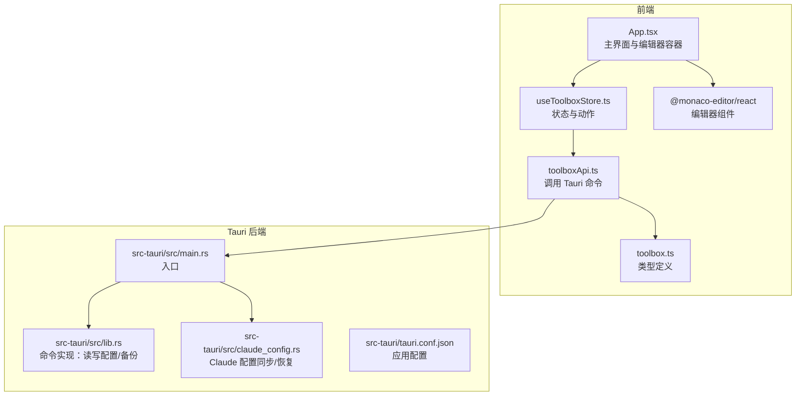
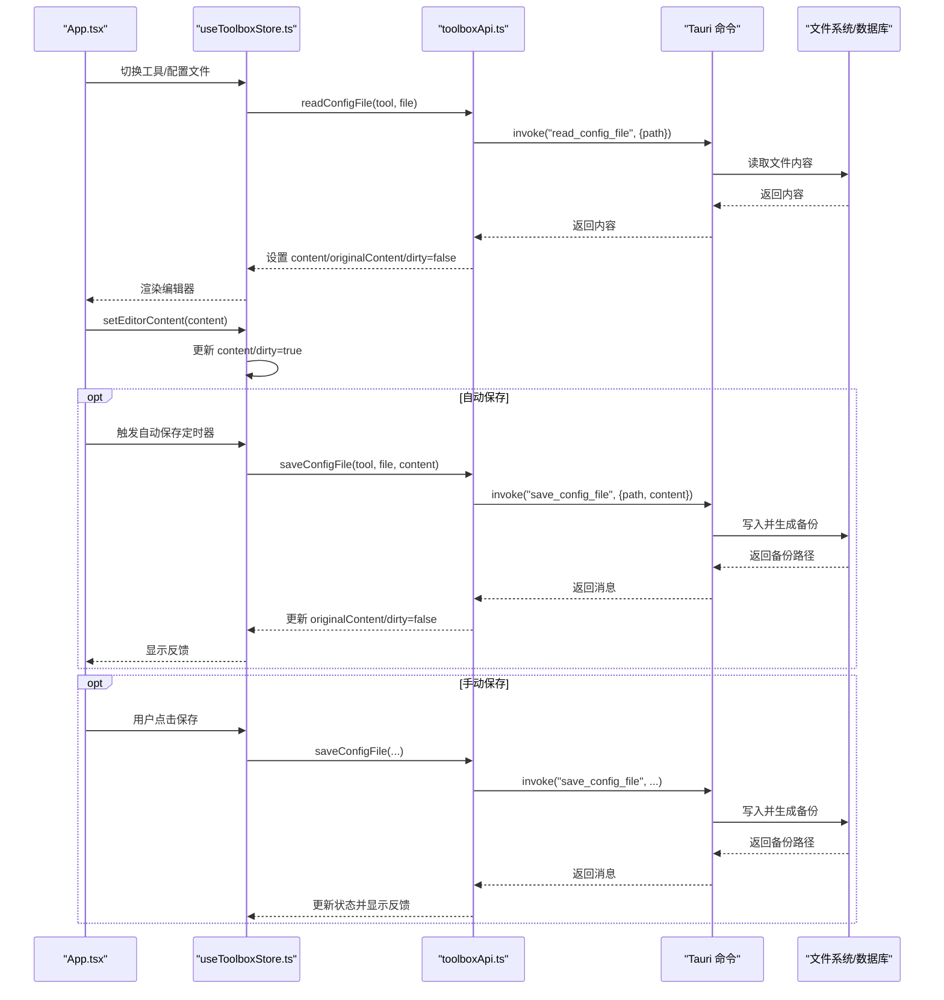
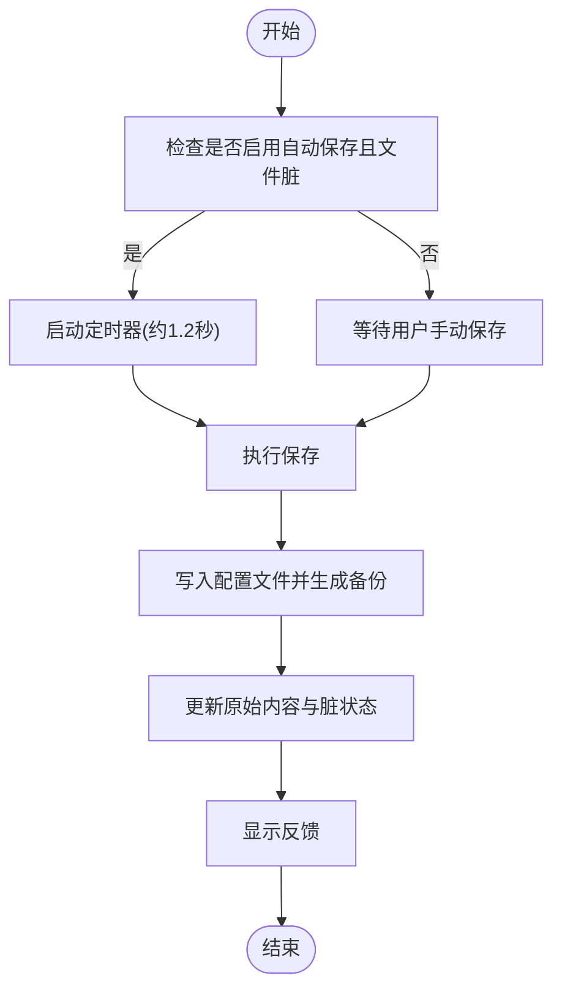
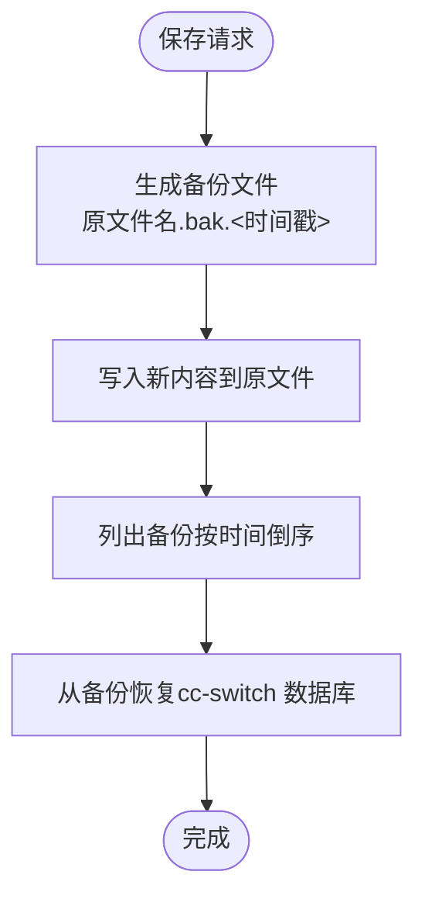
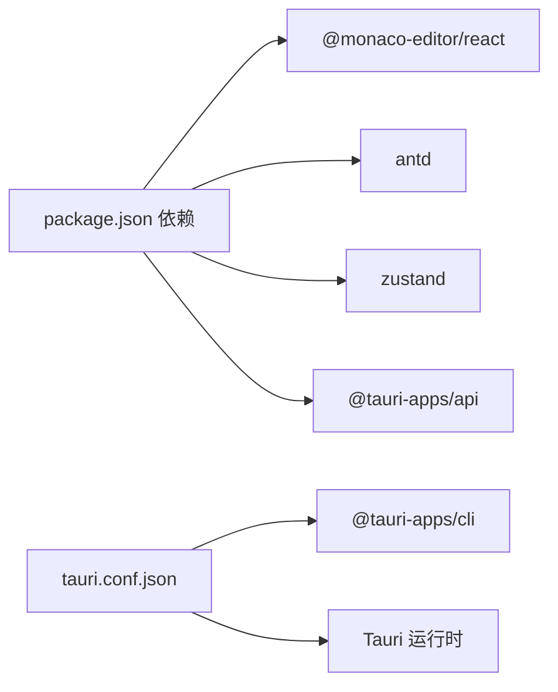

# 配置编辑

<cite>
**本文引用的文件**
- [App.tsx](file://src/App.tsx)
- [useToolboxStore.ts](file://src/store/useToolboxStore.ts)
- [toolboxApi.ts](file://src/lib/toolboxApi.ts)
- [toolbox.ts](file://src/types/toolbox.ts)
- [package.json](file://package.json)
- [tauri.conf.json](file://src-tauri/tauri.conf.json)
- [main.rs](file://src-tauri/src/main.rs)
- [lib.rs](file://src-tauri/src/lib.rs)
- [claude_config.rs](file://src-tauri/src/claude_config.rs)
- [CenterRepoPanel.tsx](file://src/components/CenterRepoPanel.tsx)
- [ClaudeConfigSyncPanel.tsx](file://src/components/ClaudeConfigSyncPanel.tsx)
- [PresetManager.tsx](file://src/components/PresetManager.tsx)
- [SkillDetailDrawer.tsx](file://src/components/SkillDetailDrawer.tsx)
</cite>

## 目录
1. [简介](#简介)
2. [项目结构](#项目结构)
3. [核心组件](#核心组件)
4. [架构总览](#架构总览)
5. [详细组件分析](#详细组件分析)
6. [依赖关系分析](#依赖关系分析)
7. [性能考量](#性能考量)
8. [故障排查指南](#故障排查指南)
9. [结论](#结论)
10. [附录](#附录)

## 简介
本文件聚焦于 AI 工具箱的“配置编辑”能力，围绕内置 Monaco Editor 的集成与使用，系统性阐述以下主题：
- 编辑器集成与配置：Monaco Editor 的初始化、主题适配、语言识别与基础选项。
- 支持的配置格式：JSON、YAML、TOML 的语言识别与语法高亮。
- 内容获取与保存：自动保存与手动保存策略、数据一致性保障。
- 备份与恢复：配置文件备份策略、版本管理与恢复流程。
- API 接口：编辑器初始化、内容获取、保存操作等方法说明。
- 扩展与集成：如何进行自定义扩展与第三方集成。

## 项目结构
AI 工具箱采用前端 React + Zustand 状态管理 + Tauri 后端的架构。配置编辑功能主要由前端负责渲染与交互，通过 Tauri 命令访问后端能力（如读取/保存配置、列出备份、执行 Claude 配置同步等）。

图表来源
- [App.tsx](file://src/App.tsx)
- [useToolboxStore.ts](file://src/store/useToolboxStore.ts)
- [toolboxApi.ts](file://src/lib/toolboxApi.ts)
- [toolbox.ts](file://src/types/toolbox.ts)
- [main.rs](file://src-tauri/src/main.rs)
- [lib.rs](file://src-tauri/src/lib.rs)
- [claude_config.rs](file://src-tauri/src/claude_config.rs)
- [tauri.conf.json](file://src-tauri/tauri.conf.json)

章节来源
- [App.tsx](file://src/App.tsx)
- [useToolboxStore.ts](file://src/store/useToolboxStore.ts)
- [toolboxApi.ts](file://src/lib/toolboxApi.ts)
- [toolbox.ts](file://src/types/toolbox.ts)
- [main.rs](file://src-tauri/src/main.rs)
- [lib.rs](file://src-tauri/src/lib.rs)
- [claude_config.rs](file://src-tauri/src/claude_config.rs)
- [tauri.conf.json](file://src-tauri/tauri.conf.json)

## 核心组件
- 编辑器容器与主题：在主界面中根据系统/用户偏好设置 Monaco 主题（vs 或 vs-dark），并传入编辑器实例。
- 状态管理：Zustand Store 统一维护工具列表、当前选中配置文件、内容、脏状态、保存状态与反馈信息。
- API 层：封装 Tauri 命令，提供读取配置、保存配置、列出备份、同步技能、预设管理、Claude 配置差异与同步等能力。
- 类型系统：统一的 TypeScript 类型定义，确保前后端契约一致。

章节来源
- [App.tsx](file://src/App.tsx)
- [useToolboxStore.ts](file://src/store/useToolboxStore.ts)
- [toolboxApi.ts](file://src/lib/toolboxApi.ts)
- [toolbox.ts](file://src/types/toolbox.ts)

## 架构总览
配置编辑的端到端流程如下：

图表来源
- [App.tsx](file://src/App.tsx)
- [useToolboxStore.ts](file://src/store/useToolboxStore.ts)
- [toolboxApi.ts](file://src/lib/toolboxApi.ts)
- [lib.rs](file://src-tauri/src/lib.rs)

章节来源
- [App.tsx](file://src/App.tsx)
- [useToolboxStore.ts](file://src/store/useToolboxStore.ts)
- [toolboxApi.ts](file://src/lib/toolboxApi.ts)
- [lib.rs](file://src-tauri/src/lib.rs)

## 详细组件分析

### Monaco 编辑器集成与配置
- 语言识别：根据文件路径后缀自动推断语言（json/yaml/toml/ini/markdown/shell/javascript/typescript 等）。
- 主题适配：依据系统主题与用户设置，动态切换 Monaco 主题（vs/vs-dark）。
- 编辑器选项：启用自动布局、字体大小、滚动优化、光标平滑等基础体验优化。
- 事件绑定：onChange 回调通过 Store 更新内容与脏状态，触发自动保存逻辑。

章节来源
- [App.tsx](file://src/App.tsx)
- [toolboxApi.ts](file://src/lib/toolboxApi.ts)

### 支持的配置格式与语法高亮
- 语言识别规则：基于文件扩展名映射到 Monaco 语言标识，确保正确的语法高亮与基本语义支持。
- 已支持格式：JSON、YAML（.yaml/.yml）、TOML、INI、Markdown、Shell、JavaScript、TypeScript 等。
- 未识别格式：回退为纯文本。

章节来源
- [toolboxApi.ts](file://src/lib/toolboxApi.ts)

### 自动保存与手动保存
- 自动保存策略：当启用自动保存且内容发生变更时，延迟约 1.2 秒触发保存；避免频繁 IO。
- 手动保存策略：用户显式点击保存按钮时立即执行保存。
- 数据一致性：保存成功后，将当前内容作为原始内容，清空脏状态；失败时保留原内容并显示错误反馈。

图表来源
- [App.tsx](file://src/App.tsx)
- [useToolboxStore.ts](file://src/store/useToolboxStore.ts)
- [lib.rs](file://src-tauri/src/lib.rs)

章节来源
- [App.tsx](file://src/App.tsx)
- [useToolboxStore.ts](file://src/store/useToolboxStore.ts)
- [lib.rs](file://src-tauri/src/lib.rs)

### 配置文件备份与恢复
- 备份策略：每次保存前以“原文件名.bak.<时间戳>”的形式生成备份；若原文件存在则复制，否则创建空备份。
- 版本管理：按时间戳排序，便于查看与选择历史版本。
- 恢复流程：提供列出备份、从备份恢复 cc-switch 数据库的能力，用于 Claude 配置场景。

图表来源
- [lib.rs](file://src-tauri/src/lib.rs)
- [claude_config.rs](file://src-tauri/src/claude_config.rs)

章节来源
- [lib.rs](file://src-tauri/src/lib.rs)
- [claude_config.rs](file://src-tauri/src/claude_config.rs)

### API 接口文档
- 读取配置文件
  - 方法：readConfigFile(tool, file)
  - 行为：返回文件内容，设置原始内容与脏状态
  - 返回：字符串内容
- 保存配置文件
  - 方法：saveConfigFile(tool, file, content)
  - 行为：写入内容并生成备份，返回备份路径或通用消息
  - 返回：字符串消息（含备份路径）
- 列出配置备份
  - 方法：listConfigBackups(path)
  - 行为：按时间倒序列出备份项
  - 返回：BackupItem[]（包含路径、名称、更新时间）
- 其他相关命令（示例）
  - 同步技能：syncSkills(params)
  - 预设管理：listPresets/savePreset/deletePreset
  - Claude 配置差异与同步：getClaudeConfigDiff/applyClaudeConfigFullSync/listClaudeSettingsSnapshots/restoreCswitchDbFromBackup
  - 技能详情：getSkillDetail/discoverCenterSkills/batchSyncFromCenter 等

章节来源
- [toolboxApi.ts](file://src/lib/toolboxApi.ts)
- [lib.rs](file://src-tauri/src/lib.rs)
- [claude_config.rs](file://src-tauri/src/claude_config.rs)

### 配置格式转换、语法高亮与智能提示
- 语法高亮：基于 Monaco 的语言识别与内置高亮规则，自动为 JSON/YAML/TOML 等提供语法高亮。
- 智能提示：Monaco 提供基于语言的补全与诊断能力；项目中未引入额外语言服务（如 JSON Schema 校验），因此不提供深层校验。
- 格式转换：前端未实现格式互转逻辑；如需转换，请在外部工具处理后再粘贴至编辑器。

章节来源
- [toolboxApi.ts](file://src/lib/toolboxApi.ts)
- [App.tsx](file://src/App.tsx)

### 自定义扩展与第三方集成
- Monaco 扩展点：可通过 @monaco-editor/react 的 onMount/onValidate 等回调接入自定义校验、快捷键与插件。
- Tauri 命令扩展：在 Rust 侧新增命令并在前端通过 toolboxApi.ts 暴露，遵循现有类型与错误处理模式。
- 第三方集成建议：如需 JSON Schema 校验或 YAML/TOML 解析增强，可在前端引入相应库并通过 onMount 注入语言服务；注意体积与性能影响。

章节来源
- [App.tsx](file://src/App.tsx)
- [toolboxApi.ts](file://src/lib/toolboxApi.ts)
- [main.rs](file://src-tauri/src/main.rs)

## 依赖关系分析
- 前端依赖
  - @monaco-editor/react：编辑器核心
  - antd/zustand：UI 与状态管理
  - @tauri-apps/api：与后端通信
- 后端依赖
  - Tauri CLI 与运行时：命令注册与安全策略
  - Rust 文件系统与 SQLite（用于 cc-switch 恢复）

图表来源
- [package.json](file://package.json)
- [tauri.conf.json](file://src-tauri/tauri.conf.json)

章节来源
- [package.json](file://package.json)
- [tauri.conf.json](file://src-tauri/tauri.conf.json)

## 性能考量
- 自动保存节流：1.2 秒防抖，减少频繁写盘。
- 编辑器选项优化：禁用 minimap、启用自动布局与平滑滚动，兼顾性能与体验。
- 异步加载：读取/保存均通过异步命令，避免阻塞主线程。
- 备份策略：仅在保存时生成备份，避免冗余 IO。

## 故障排查指南
- 无法保存
  - 检查文件权限与路径有效性
  - 查看保存返回消息中的备份路径，确认备份是否生成
- 无法读取
  - 确认文件是否存在且可读
  - 检查工具注册的配置文件路径是否正确
- 备份与恢复
  - 使用 listConfigBackups 获取备份列表
  - 使用 restoreCswitchDbFromBackup 恢复 cc-switch 数据库（仅 Claude 场景）

章节来源
- [toolboxApi.ts](file://src/lib/toolboxApi.ts)
- [lib.rs](file://src-tauri/src/lib.rs)
- [claude_config.rs](file://src-tauri/src/claude_config.rs)

## 结论
AI 工具箱的配置编辑功能以 Monaco Editor 为核心，结合前端状态管理与 Tauri 命令，实现了：
- 语言识别与语法高亮
- 自动/手动保存与备份
- 备份版本管理与恢复
- 与 Claude 配置同步的深度集成

对于更复杂的校验与格式转换需求，建议在前端引入语言服务或在后端扩展命令实现。

## 附录
- 相关组件参考
  - 中央仓库面板：技能发现、批量同步与分类管理
  - Claude 配置同步面板：字段差异对比与整段同步
  - 预设管理：技能集合的保存与批量应用
  - 技能详情抽屉：展示技能文档内容

章节来源
- [CenterRepoPanel.tsx](file://src/components/CenterRepoPanel.tsx)
- [ClaudeConfigSyncPanel.tsx](file://src/components/ClaudeConfigSyncPanel.tsx)
- [PresetManager.tsx](file://src/components/PresetManager.tsx)
- [SkillDetailDrawer.tsx](file://src/components/SkillDetailDrawer.tsx)