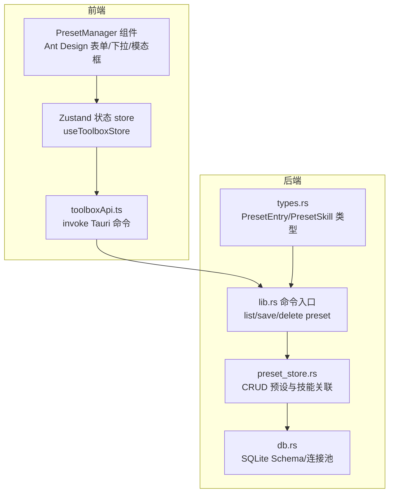
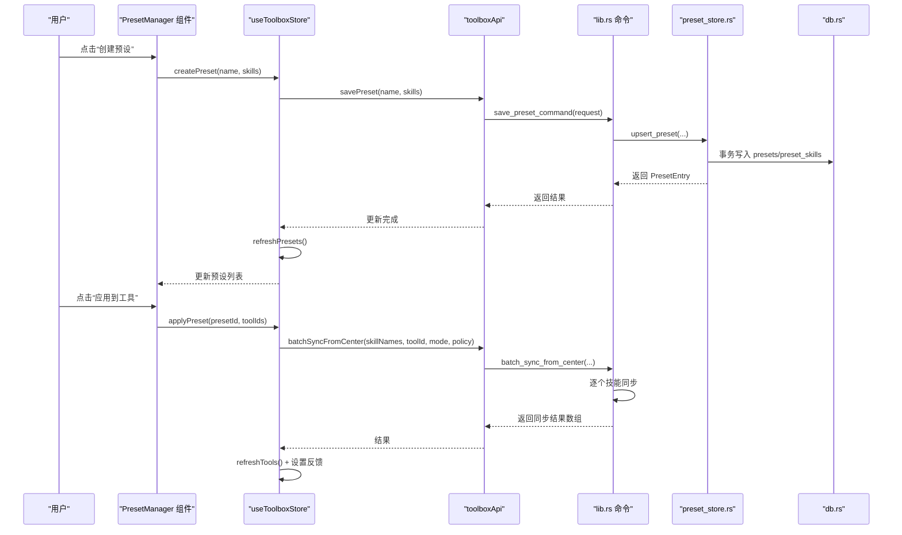
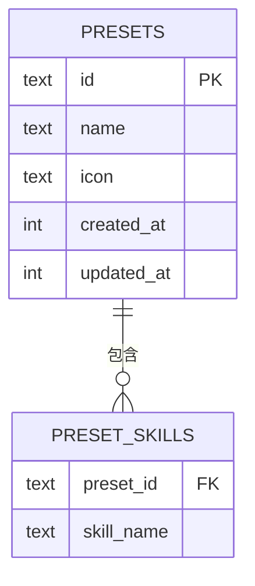
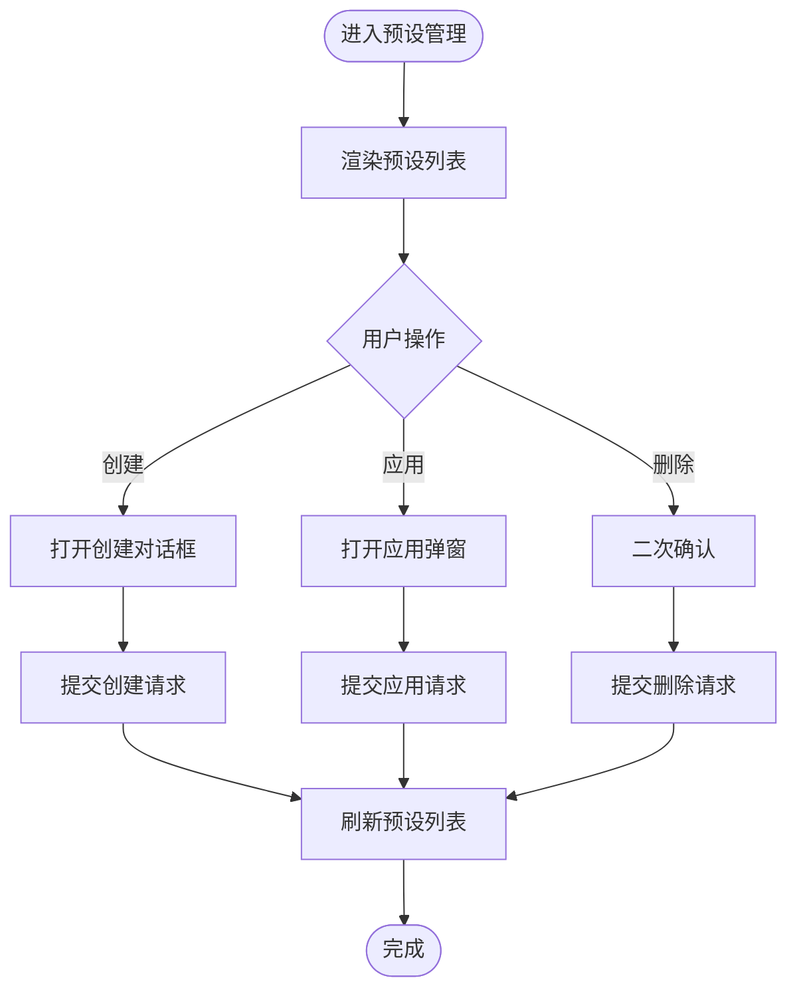
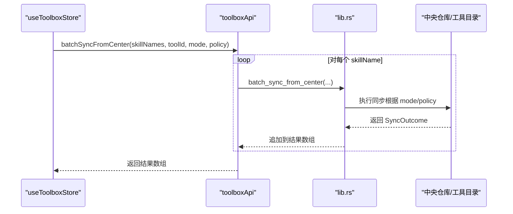
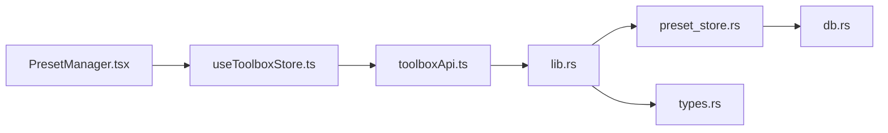
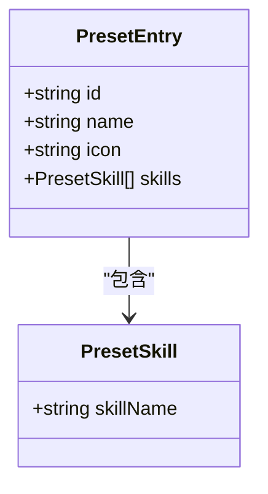

# 预设管理

<cite>
**本文引用的文件**
- [src/components/PresetManager.tsx](file://src/components/PresetManager.tsx)
- [src/store/useToolboxStore.ts](file://src/store/useToolboxStore.ts)
- [src/types/toolbox.ts](file://src/types/toolbox.ts)
- [src/lib/toolboxApi.ts](file://src/lib/toolboxApi.ts)
- [src-tauri/src/store/preset_store.rs](file://src-tauri/src/store/preset_store.rs)
- [src-tauri/src/db.rs](file://src-tauri/src/db.rs)
- [src-tauri/src/types.rs](file://src-tauri/src/types.rs)
- [src-tauri/src/lib.rs](file://src-tauri/src/lib.rs)
- [src/App.tsx](file://src/App.tsx)
</cite>

## 目录
1. [简介](#简介)
2. [项目结构](#项目结构)
3. [核心组件](#核心组件)
4. [架构总览](#架构总览)
5. [详细组件分析](#详细组件分析)
6. [依赖关系分析](#依赖关系分析)
7. [性能考量](#性能考量)
8. [故障排查指南](#故障排查指南)
9. [结论](#结论)
10. [附录](#附录)

## 简介
本章节概述 AI 工具箱的“预设管理”能力：用户可通过图形界面创建、编辑、删除和应用“预设”，每个预设由一组技能名称组成，应用时会将这些技能批量同步到目标工具。系统支持：
- 预设的增删改查
- 批量应用与冲突策略
- 数据持久化（SQLite）
- 前端 UI 交互与状态管理
- 与中央仓库技能中心的同步流程

## 项目结构
预设管理涉及三层协作：
- 前端 UI 层：负责展示预设列表、创建/删除对话框、应用弹窗与用户交互
- 前端状态层：集中管理工具、技能洞察、反馈消息与预设集合
- 后端命令层：提供 Tauri 命令，访问 SQLite 存储并调用技能同步逻辑

**图表来源**
- [src/components/PresetManager.tsx](file://src/components/PresetManager.tsx)
- [src/store/useToolboxStore.ts](file://src/store/useToolboxStore.ts)
- [src/lib/toolboxApi.ts](file://src/lib/toolboxApi.ts)
- [src-tauri/src/lib.rs](file://src-tauri/src/lib.rs)
- [src-tauri/src/store/preset_store.rs](file://src-tauri/src/store/preset_store.rs)
- [src-tauri/src/db.rs](file://src-tauri/src/db.rs)
- [src-tauri/src/types.rs](file://src-tauri/src/types.rs)

**章节来源**
- [src/components/PresetManager.tsx](file://src/components/PresetManager.tsx)
- [src/store/useToolboxStore.ts](file://src/store/useToolboxStore.ts)
- [src/lib/toolboxApi.ts](file://src/lib/toolboxApi.ts)
- [src-tauri/src/lib.rs](file://src-tauri/src/lib.rs)

## 核心组件
- 预设管理 UI 组件：提供“创建预设”“应用到工具”“删除”等操作入口，支持多选目标工具批量应用
- 状态管理：维护预设列表、加载状态、反馈消息与全局同步参数（复制/软链、冲突策略）
- API 封装：统一调用 Tauri 命令，屏蔽前端与后端细节
- 后端存储：SQLite 表 presets 与 preset_skills，事务保证一致性
- 类型定义：前后端共享的预设数据模型

**章节来源**
- [src/components/PresetManager.tsx](file://src/components/PresetManager.tsx)
- [src/store/useToolboxStore.ts](file://src/store/useToolboxStore.ts)
- [src/types/toolbox.ts](file://src/types/toolbox.ts)
- [src-tauri/src/types.rs](file://src-tauri/src/types.rs)

## 架构总览
预设生命周期的关键流程如下：

**图表来源**
- [src/components/PresetManager.tsx](file://src/components/PresetManager.tsx)
- [src/store/useToolboxStore.ts](file://src/store/useToolboxStore.ts)
- [src/lib/toolboxApi.ts](file://src/lib/toolboxApi.ts)
- [src-tauri/src/lib.rs](file://src-tauri/src/lib.rs)
- [src-tauri/src/store/preset_store.rs](file://src-tauri/src/store/preset_store.rs)
- [src-tauri/src/db.rs](file://src-tauri/src/db.rs)

## 详细组件分析

### 预设数据模型与持久化
- 数据模型
  - 预设条目：包含 id、name、icon、skills
  - 技能条目：仅包含 skillName 字段
- 存储结构
  - 表 presets：id、name、icon、created_at、updated_at
  - 表 preset_skills：preset_id、skill_name（联合主键），外键级联删除
- 写入策略
  - upsert：存在则更新，否则插入；先清理旧关联，再写入新关联
  - 事务：确保预设与技能关联的一致性
- 查询策略
  - 列表：按创建时间排序，同时加载技能列表
  - 单条：按 id 查询并加载技能

**图表来源**
- [src-tauri/src/db.rs](file://src-tauri/src/db.rs)
- [src-tauri/src/store/preset_store.rs](file://src-tauri/src/store/preset_store.rs)
- [src-tauri/src/types.rs](file://src-tauri/src/types.rs)

**章节来源**
- [src-tauri/src/db.rs](file://src-tauri/src/db.rs)
- [src-tauri/src/store/preset_store.rs](file://src-tauri/src/store/preset_store.rs)
- [src-tauri/src/types.rs](file://src-tauri/src/types.rs)

### 预设 UI 组件与交互
- 功能点
  - 预设列表：展示名称、技能数量、快捷菜单（应用/编辑/删除）
  - 创建对话框：表单校验（名称必填、技能必选）、多选技能
  - 应用弹窗：多选目标工具，提交后批量同步
  - 删除确认：二次确认防止误删
- 状态与反馈
  - 加载状态、空状态占位
  - 成功/失败提示与错误信息

**图表来源**
- [src/components/PresetManager.tsx](file://src/components/PresetManager.tsx)

**章节来源**
- [src/components/PresetManager.tsx](file://src/components/PresetManager.tsx)

### 批量应用机制与冲突处理
- 应用流程
  - 读取预设中的技能名集合
  - 对每个目标工具逐一调用批量同步命令
  - 收集每项同步结果，汇总反馈
- 冲突策略
  - 支持 skip、overwrite、rename 三种策略
  - 通过命令参数传入后端执行
- 回滚策略
  - 当前实现未提供自动回滚；建议在上层 UI 提示用户备份后再执行

**图表来源**
- [src/store/useToolboxStore.ts](file://src/store/useToolboxStore.ts)
- [src/lib/toolboxApi.ts](file://src/lib/toolboxApi.ts)
- [src-tauri/src/lib.rs](file://src-tauri/src/lib.rs)

**章节来源**
- [src/store/useToolboxStore.ts](file://src/store/useToolboxStore.ts)
- [src/lib/toolboxApi.ts](file://src/lib/toolboxApi.ts)
- [src-tauri/src/lib.rs](file://src-tauri/src/lib.rs)

### API 接口文档
- 预设相关
  - 列出预设：listPresets → list_presets_command
  - 保存预设：savePreset → save_preset_command
  - 删除预设：deletePreset → delete_preset_command
- 批量应用
  - 批量同步：batchSyncFromCenter → batch_sync_from_center
- 参数与返回
  - 参数类型：UpsertPresetRequest、DeletePresetRequest、ApplyPresetRequest
  - 返回类型：PresetEntry、Vec<SyncOutcome>

**章节来源**
- [src/lib/toolboxApi.ts](file://src/lib/toolboxApi.ts)
- [src-tauri/src/lib.rs](file://src-tauri/src/lib.rs)
- [src-tauri/src/types.rs](file://src-tauri/src/types.rs)

### 用户界面设计
- 预设列表展示
  - 名称、技能数量徽标、工具提示显示技能列表
- 编辑器界面
  - 创建对话框：垂直布局、必填校验、多选下拉
  - 应用弹窗：多选目标工具、提交前校验
- 操作反馈
  - 成功/失败消息、加载指示器、空状态占位

**章节来源**
- [src/components/PresetManager.tsx](file://src/components/PresetManager.tsx)
- [src/App.tsx](file://src/App.tsx)

### 分享与导入导出（扩展性）
- 当前实现
  - 未发现内置的预设分享/导入导出命令
- 扩展建议
  - 导出：将 PresetEntry 序列化为 JSON，包含 id/name/skills
  - 导入：解析 JSON 并调用 save_preset_command；注意去重与合法性校验
  - 版本兼容：在 JSON 中加入版本号字段，迁移时进行字段映射

[本节为概念性扩展说明，不直接分析具体文件]

## 依赖关系分析
- 前端依赖
  - Ant Design UI 组件库
  - Zustand 状态管理
  - @tauri-apps/api invoke
- 后端依赖
  - rusqlite（SQLite）
  - serde（序列化）
  - tauri 命令系统
- 关系图

**图表来源**
- [src/components/PresetManager.tsx](file://src/components/PresetManager.tsx)
- [src/store/useToolboxStore.ts](file://src/store/useToolboxStore.ts)
- [src/lib/toolboxApi.ts](file://src/lib/toolboxApi.ts)
- [src-tauri/src/lib.rs](file://src-tauri/src/lib.rs)
- [src-tauri/src/store/preset_store.rs](file://src-tauri/src/store/preset_store.rs)
- [src-tauri/src/db.rs](file://src-tauri/src/db.rs)
- [src-tauri/src/types.rs](file://src-tauri/src/types.rs)

**章节来源**
- [src/components/PresetManager.tsx](file://src/components/PresetManager.tsx)
- [src/store/useToolboxStore.ts](file://src/store/useToolboxStore.ts)
- [src/lib/toolboxApi.ts](file://src/lib/toolboxApi.ts)
- [src-tauri/src/lib.rs](file://src-tauri/src/lib.rs)

## 性能考量
- 批量应用
  - 逐个工具串行同步，复杂度 O(N)；如需提升性能，可在后端引入并发与队列
- 数据库
  - upsert 使用事务，避免中间状态；索引已覆盖常用查询
- 前端
  - 列表渲染使用 useMemo 与受控组件，减少重渲染
- 建议
  - 大规模预设场景：分页加载、懒加载技能详情、缓存最近使用的预设

[本节为通用指导，不直接分析具体文件]

## 故障排查指南
- 常见问题
  - 预设不存在：检查 id 是否正确，是否已刷新列表
  - 预设中无技能：创建时必须选择至少一个技能
  - 应用目标为空：应用前需至少选择一个目标工具
  - 同步失败：查看返回的 SyncOutcome，定位具体技能与工具
- 错误处理
  - 前端统一通过 OperationFeedback 显示错误信息
  - 后端命令返回错误字符串，前端捕获并展示

**章节来源**
- [src/store/useToolboxStore.ts](file://src/store/useToolboxStore.ts)
- [src-tauri/src/lib.rs](file://src-tauri/src/lib.rs)

## 结论
预设管理以简洁的 UI 和清晰的命令流实现了“技能组合”的快速复用。通过 SQLite 的事务与索引保障了数据一致性与查询效率；前端状态与 UI 的解耦使得后续扩展（如分享/导入导出、自定义预设类型）具备良好基础。

## 附录

### 数据模型类图

**图表来源**
- [src/types/toolbox.ts](file://src/types/toolbox.ts)
- [src-tauri/src/types.rs](file://src-tauri/src/types.rs)