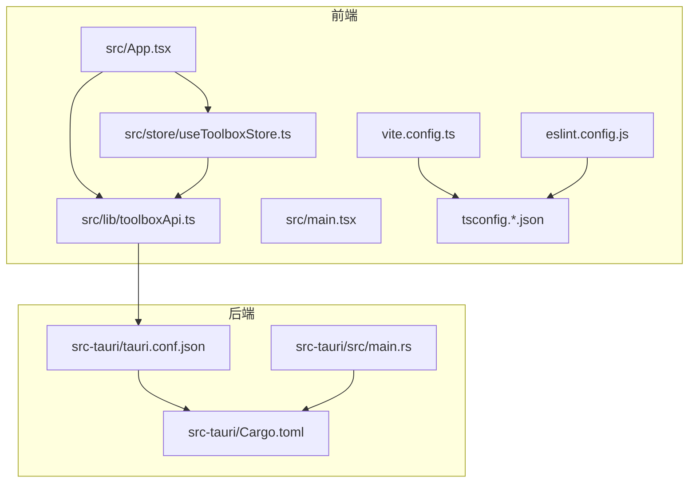
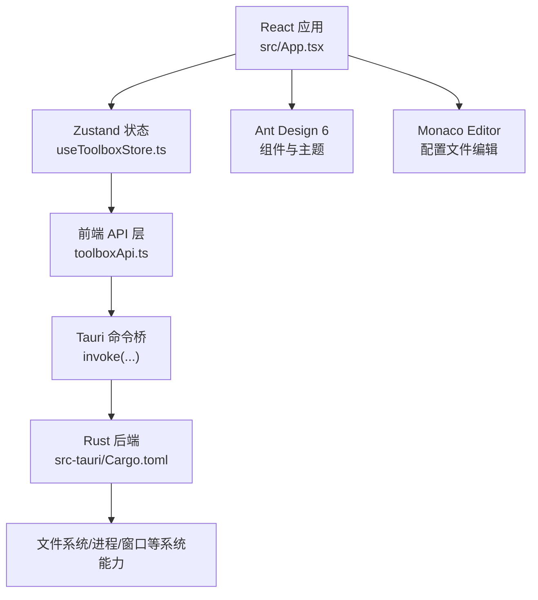
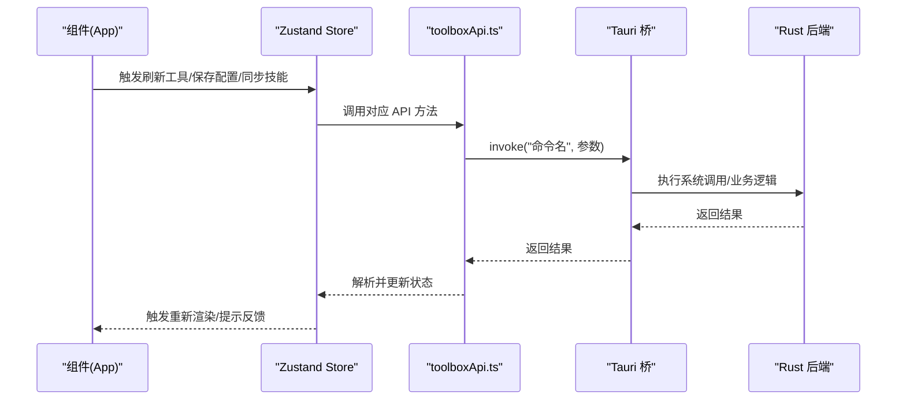
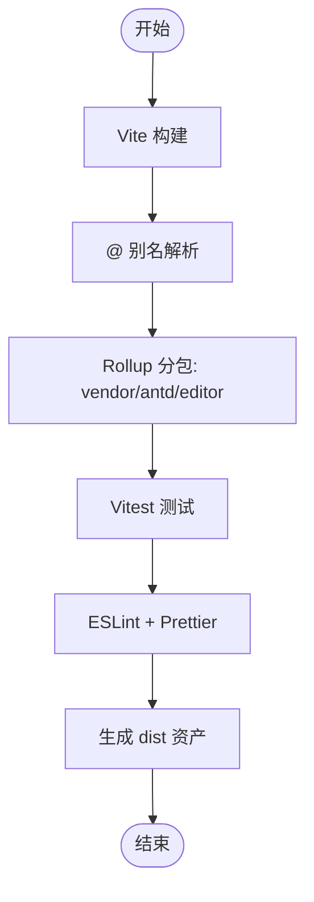
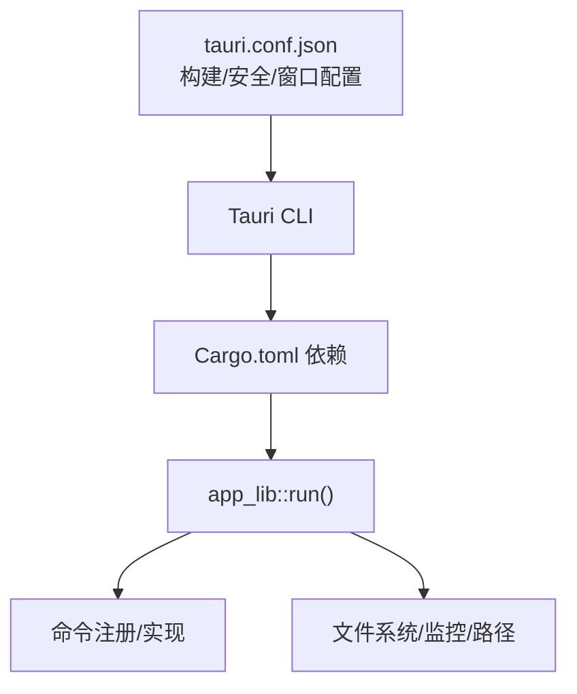
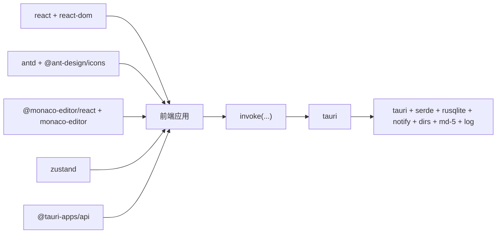

# 技术栈

<cite>
**本文引用的文件**
- [package.json](file://package.json)
- [vite.config.ts](file://vite.config.ts)
- [tsconfig.json](file://tsconfig.json)
- [tsconfig.app.json](file://tsconfig.app.json)
- [tsconfig.node.json](file://tsconfig.node.json)
- [eslint.config.js](file://eslint.config.js)
- [src-tauri/Cargo.toml](file://src-tauri/Cargo.toml)
- [src-tauri/tauri.conf.json](file://src-tauri/tauri.conf.json)
- [src-tauri/src/main.rs](file://src-tauri/src/main.rs)
- [src/main.tsx](file://src/main.tsx)
- [src/App.tsx](file://src/App.tsx)
- [src/store/useToolboxStore.ts](file://src/store/useToolboxStore.ts)
- [src/lib/toolboxApi.ts](file://src/lib/toolboxApi.ts)
- [src/types/toolbox.ts](file://src/types/toolbox.ts)
</cite>

## 目录
1. [简介](#简介)
2. [项目结构](#项目结构)
3. [核心组件](#核心组件)
4. [架构总览](#架构总览)
5. [详细组件分析](#详细组件分析)
6. [依赖关系分析](#依赖关系分析)
7. [性能考量](#性能考量)
8. [故障排查指南](#故障排查指南)
9. [结论](#结论)
10. [附录](#附录)

## 简介
本项目采用“前端 React 19 + TypeScript + Vite + Ant Design 6 + Monaco Editor + Zustand”与“后端 Rust + Tauri 2”的混合技术栈，围绕本地 AI 工具配置与技能管理场景，提供高性能、可扩展且跨平台的桌面应用体验。该技术栈在开发效率、运行时性能、类型安全与原生能力之间取得平衡，并通过模块化与分层设计支持后续演进。

## 项目结构
项目采用前后端分离但紧密集成的组织方式：
- 前端位于 src 目录，使用 React 19 + TypeScript 构建 UI 与状态逻辑，配合 Vite 提供快速开发与打包。
- 后端位于 src-tauri 目录，使用 Rust + Tauri 2 实现系统级能力（文件系统、进程、窗口控制等），并通过命令桥接与前端通信。
- 配置文件集中于根目录，包括包管理、构建、类型检查、代码风格与测试配置。

图表来源
- [src/App.tsx:1-120](file://src/App.tsx#L1-L120)
- [src/store/useToolboxStore.ts:1-120](file://src/store/useToolboxStore.ts#L1-L120)
- [src/lib/toolboxApi.ts:1-60](file://src/lib/toolboxApi.ts#L1-L60)
- [src/main.tsx:1-12](file://src/main.tsx#L1-L12)
- [vite.config.ts:1-31](file://vite.config.ts#L1-L31)
- [tsconfig.app.json:1-37](file://tsconfig.app.json#L1-L37)
- [eslint.config.js:1-53](file://eslint.config.js#L1-L53)
- [src-tauri/tauri.conf.json:1-43](file://src-tauri/tauri.conf.json#L1-L43)
- [src-tauri/Cargo.toml:1-30](file://src-tauri/Cargo.toml#L1-L30)
- [src-tauri/src/main.rs:1-7](file://src-tauri/src/main.rs#L1-L7)

章节来源
- [package.json:1-63](file://package.json#L1-L63)
- [vite.config.ts:1-31](file://vite.config.ts#L1-L31)
- [tsconfig.json:1-8](file://tsconfig.json#L1-L8)
- [tsconfig.app.json:1-37](file://tsconfig.app.json#L1-L37)
- [tsconfig.node.json:1-25](file://tsconfig.node.json#L1-L25)
- [eslint.config.js:1-53](file://eslint.config.js#L1-L53)
- [src-tauri/Cargo.toml:1-30](file://src-tauri/Cargo.toml#L1-L30)
- [src-tauri/tauri.conf.json:1-43](file://src-tauri/tauri.conf.json#L1-L43)
- [src-tauri/src/main.rs:1-7](file://src-tauri/src/main.rs#L1-L7)
- [src/main.tsx:1-12](file://src/main.tsx#L1-L12)

## 核心组件
- 前端框架与类型系统
  - React 19：提供声明式 UI 与高效渲染；结合严格 TS 类型定义确保数据一致性。
  - TypeScript：多份 tsconfig 文件分别约束应用与 Node 工具链，开启严格模式与 bundler 模式。
- 构建与开发工具
  - Vite：快速冷启动与热更新，按需拆分 vendor/antd/editor 等大包，提升首屏性能。
  - ESLint + Prettier：统一代码风格与质量门禁，支持 lint-staged 与 husky。
- 状态管理
  - Zustand：轻量、函数式状态模型，便于在组件间共享复杂业务状态（工具列表、配置文件、技能洞察、预设等）。
- UI 组件库与编辑器
  - Ant Design 6：提供成熟的设计体系与高复用组件；结合 ConfigProvider 主题定制。
  - Monaco Editor：内嵌 VS Code 引擎，满足配置文件编辑与语法高亮需求。
- 桌面集成与后端能力
  - Tauri 2：通过 Rust 实现安全的系统调用（文件系统、窗口控制、进程交互），前端通过 invoke 调用后端命令。

章节来源
- [package.json:29-61](file://package.json#L29-L61)
- [vite.config.ts:6-30](file://vite.config.ts#L6-L30)
- [tsconfig.app.json:10-32](file://tsconfig.app.json#L10-L32)
- [tsconfig.node.json:6-21](file://tsconfig.node.json#L6-L21)
- [src/store/useToolboxStore.ts:32-84](file://src/store/useToolboxStore.ts#L32-L84)
- [src/App.tsx:28-49](file://src/App.tsx#L28-L49)
- [src/lib/toolboxApi.ts:1-21](file://src/lib/toolboxApi.ts#L1-L21)
- [src-tauri/Cargo.toml:20-30](file://src-tauri/Cargo.toml#L20-L30)
- [src-tauri/tauri.conf.json:6-11](file://src-tauri/tauri.conf.json#L6-L11)

## 架构总览
整体架构由“前端应用 + Tauri 桥接 + Rust 后端”三层组成，前端负责 UI 与状态，Tauri 负责系统能力与命令桥接，Rust 负责具体实现与安全边界。

图表来源
- [src/App.tsx:138-250](file://src/App.tsx#L138-L250)
- [src/store/useToolboxStore.ts:145-181](file://src/store/useToolboxStore.ts#L145-L181)
- [src/lib/toolboxApi.ts:387-465](file://src/lib/toolboxApi.ts#L387-L465)
- [src-tauri/Cargo.toml:20-30](file://src-tauri/Cargo.toml#L20-L30)

## 详细组件分析

### 前端应用与状态流
- 入口与主题
  - 应用入口初始化 Ant Design 样式与全局样式，随后挂载根组件。
  - 主题通过 ConfigProvider 注入，支持系统/浅色/深色三态切换与持久化。
- 状态模型
  - 使用 Zustand 定义工具、配置文件、技能洞察、预设、反馈等状态域，提供批量异步操作（如刷新工具、保存配置、同步技能、应用预设等）。
- 数据流
  - 组件通过 store 方法触发 API 调用，API 层根据是否处于 Tauri 环境决定真实调用或返回模拟数据。
  - API 层封装 invoke 调用，统一响应解析与错误处理。

图表来源
- [src/App.tsx:351-512](file://src/App.tsx#L351-L512)
- [src/store/useToolboxStore.ts:174-205](file://src/store/useToolboxStore.ts#L174-L205)
- [src/lib/toolboxApi.ts:387-465](file://src/lib/toolboxApi.ts#L387-L465)

章节来源
- [src/main.tsx:1-12](file://src/main.tsx#L1-L12)
- [src/App.tsx:138-250](file://src/App.tsx#L138-L250)
- [src/store/useToolboxStore.ts:145-555](file://src/store/useToolboxStore.ts#L145-L555)
- [src/lib/toolboxApi.ts:387-784](file://src/lib/toolboxApi.ts#L387-L784)

### 构建与开发工具链
- Vite 配置
  - React 插件启用，路径别名 @ 指向 src。
  - Rollup 分包策略：vendor（react/react-dom）、antd（组件库）、editor（Monaco）独立 chunk，优化缓存与加载。
  - 测试环境：jsdom、vitest、setupFiles。
- TypeScript 配置
  - tsconfig.json 作为多项目引用入口，分别指向 tsconfig.app.json 与 tsconfig.node.json。
  - app 配置启用严格模式、bundler 模式、路径别名与 JSX 运行时。
  - node 配置聚焦 Vite 工具链类型。
- 代码质量
  - ESLint 平台化规则集，结合 TypeScript ESLint 与 React Hooks 规则。
  - Prettier 统一格式化，lint-staged 与 husky 在提交前执行校验。

图表来源
- [vite.config.ts:6-30](file://vite.config.ts#L6-L30)
- [tsconfig.app.json:23-26](file://tsconfig.app.json#L23-L26)
- [eslint.config.js:9-52](file://eslint.config.js#L9-L52)

章节来源
- [vite.config.ts:1-31](file://vite.config.ts#L1-L31)
- [tsconfig.json:1-8](file://tsconfig.json#L1-L8)
- [tsconfig.app.json:1-37](file://tsconfig.app.json#L1-L37)
- [tsconfig.node.json:1-25](file://tsconfig.node.json#L1-L25)
- [eslint.config.js:1-53](file://eslint.config.js#L1-L53)

### 后端与桌面集成
- Tauri 配置
  - 前端产物输出至 dist，开发时通过 beforeDevCommand 启动前端服务。
  - 安全策略与窗口特性（透明、无边框、可调整大小等）在配置中声明。
- Rust 依赖
  - 核心依赖：tauri（含日志插件）、serde、rusqlite（含内置与备份功能）、notify、dirs、md-5、log。
  - 版本与特性：启用 macOS 私有 API 支持，适配特定平台能力。
- 入口与运行
  - main.rs 仅负责调用 app_lib::run，实际逻辑在 src-tauri/src 下实现（commands、store、lib 等模块）。

图表来源
- [src-tauri/tauri.conf.json:6-11](file://src-tauri/tauri.conf.json#L6-L11)
- [src-tauri/Cargo.toml:20-30](file://src-tauri/Cargo.toml#L20-L30)
- [src-tauri/src/main.rs:4-6](file://src-tauri/src/main.rs#L4-L6)

章节来源
- [src-tauri/tauri.conf.json:1-43](file://src-tauri/tauri.conf.json#L1-L43)
- [src-tauri/Cargo.toml:1-30](file://src-tauri/Cargo.toml#L1-L30)
- [src-tauri/src/main.rs:1-7](file://src-tauri/src/main.rs#L1-L7)

### 数据模型与类型系统
- 类型定义
  - 同步模式、冲突策略、反馈音调、技能/配置/工具/洞察/预设等核心类型集中在 src/types/toolbox.ts。
  - Claude 配置差异与快照相关类型用于跨工具配置同步场景。
- API 层对齐
  - toolboxApi.ts 对后端命令返回进行统一解析与类型断言，保证前端消费稳定。

章节来源
- [src/types/toolbox.ts:1-152](file://src/types/toolbox.ts#L1-L152)
- [src/lib/toolboxApi.ts:387-465](file://src/lib/toolboxApi.ts#L387-L465)

## 依赖关系分析
- 前端依赖
  - React 19 与 Ant Design 6 提供 UI 基础；Monaco Editor 与 @monaco-editor/react 提供编辑体验；Zustand 管理状态。
  - Tauri API 用于窗口控制与系统调用桥接。
- 构建与工具
  - Vite、TypeScript、ESLint、Prettier、Husky/lint-staged 形成完整的开发与质量保障链路。
- 后端依赖
  - Tauri 2 提供安全沙箱与系统能力；rusqlite、notify、dirs、md-5 等支撑文件系统、监控与路径处理。

图表来源
- [package.json:29-37](file://package.json#L29-L37)
- [package.json:40-61](file://package.json#L40-L61)
- [src-tauri/Cargo.toml:20-30](file://src-tauri/Cargo.toml#L20-L30)

章节来源
- [package.json:1-63](file://package.json#L1-L63)
- [src-tauri/Cargo.toml:1-30](file://src-tauri/Cargo.toml#L1-L30)

## 性能考量
- 构建与分包
  - 通过 Vite 与 Rollup 的 manualChunks 将大依赖独立打包，减少重复下载与缓存失效。
- 运行时优化
  - React 19 的并发特性与 Zustand 的细粒度状态更新有助于降低重渲染成本。
  - Monaco 编辑器按需加载与语言模式，避免一次性引入过多资源。
- 后端性能
  - Rust 的零成本抽象与 Tauri 的轻量桥接，使系统调用开销可控；rusqlite 内置选项与备份能力兼顾可靠性与性能。

## 故障排查指南
- 开发环境
  - 若前端无法热更新，检查 beforeDevCommand 是否正确启动前端服务并与 Vite 端口一致。
  - 若 ESLint 报错，优先使用 lint:fix 或 lint-staged 自动修复。
- 运行时
  - 当 invoke 调用失败时，查看 Tauri 日志与后端命令实现；确认命令名称与参数结构一致。
  - 若主题或窗口行为异常，检查 ConfigProvider 主题注入与 Tauri 窗口配置。
- 状态与数据
  - 使用 Zustand Devtools（如需）观察状态变化；核对 API 层响应解析逻辑与类型定义。

章节来源
- [src-tauri/tauri.conf.json:6-11](file://src-tauri/tauri.conf.json#L6-L11)
- [eslint.config.js:23-29](file://eslint.config.js#L23-L29)
- [src/lib/toolboxApi.ts:387-465](file://src/lib/toolboxApi.ts#L387-L465)

## 结论
该技术栈在“前端现代化 + 后端原生化”的组合下，既保证了开发效率与用户体验，又提供了强大的系统能力与跨平台兼容性。通过严格的类型约束、模块化的状态管理与清晰的命令桥接，项目具备良好的可维护性与扩展性。建议在后续迭代中持续关注各生态版本演进，适时升级以获得更好的性能与安全性。

## 附录
- 学习路径与参考资料（面向开发者）
  - 前端
    - React 19：官方文档与 Hooks 指南
    - TypeScript：严格模式与 bundler 模式配置要点
    - Vite：插件体系与构建优化实践
    - Ant Design 6：主题定制与组件使用最佳实践
    - Monaco Editor：语言模式与编辑器配置
    - Zustand：状态模型设计与副作用管理
  - 后端
    - Tauri 2：命令桥接、权限与安全策略
    - Rust：基础语法、Cargo 依赖管理与错误处理
    - rusqlite/notify/dirs/md-5：文件系统与路径处理实践
- 技术选型权衡与演进方向
  - 选型理由
    - 前端：React 19 的并发与 TS 的强类型契合本项目的复杂状态与数据流；Ant Design 6 提供成熟的 UI 体系；Monaco Editor 满足配置文件编辑需求；Zustand 降低样板代码与心智负担。
    - 后端：Tauri 2 在安全与性能上优于传统 Electron 方案；Rust 提供内存安全与高性能。
  - 权衡点
    - 包体积与首屏加载：通过 Vite 分包与按需加载缓解；Monaco 的语言包与主题需谨慎引入。
    - 跨平台兼容：Tauri 的平台差异需在配置与命令实现中统一处理。
  - 未来演进
    - 前端：关注 React 新特性与 Vite 生态；逐步引入更完善的测试与可观测性方案。
    - 后端：保持 Tauri 与 Rust 版本更新；探索更多系统能力（如剪贴板、通知、托盘等）。