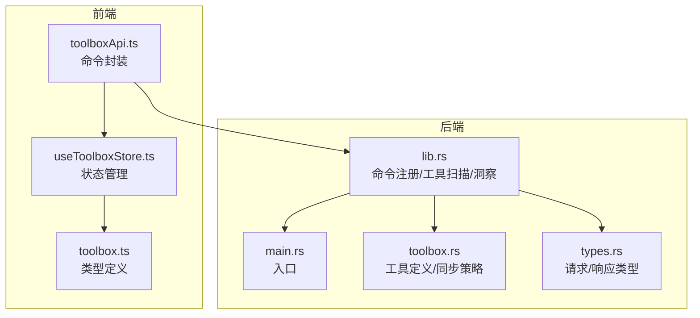
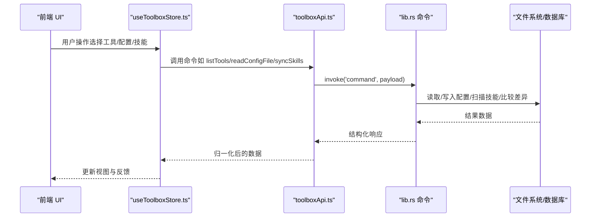
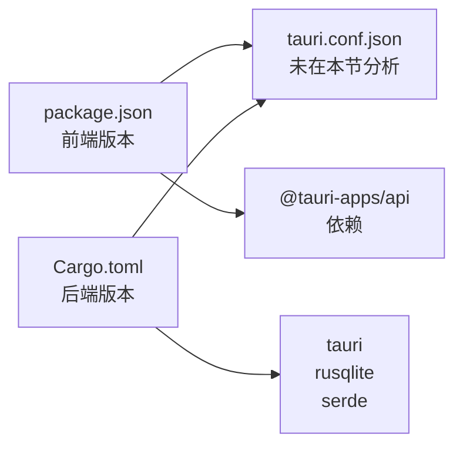
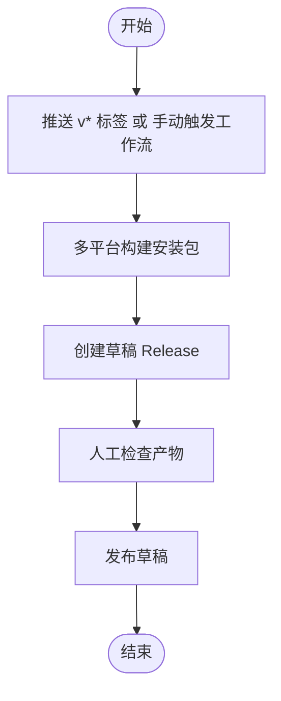

# 版本历史

<cite>
**本文引用的文件**
- [package.json](file://package.json)
- [Cargo.toml](file://src-tauri/Cargo.toml)
- [release.yml](file://.github/workflows/release.yml)
- [RELEASE.md](file://docs/RELEASE.md)
- [CHANGELOG.md](file://CHANGELOG.md)
- [README.md](file://README.md)
- [toolboxApi.ts](file://src/lib/toolboxApi.ts)
- [useToolboxStore.ts](file://src/store/useToolboxStore.ts)
- [toolbox.ts](file://src/types/toolbox.ts)
- [lib.rs](file://src-tauri/src/lib.rs)
- [main.rs](file://src-tauri/src/main.rs)
- [toolbox.rs](file://src-tauri/src/toolbox.rs)
- [types.rs](file://src-tauri/src/types.rs)
</cite>

## 目录
1. [简介](#简介)
2. [项目结构](#项目结构)
3. [核心组件](#核心组件)
4. [架构总览](#架构总览)
5. [详细组件分析](#详细组件分析)
6. [依赖关系分析](#依赖关系分析)
7. [性能考量](#性能考量)
8. [故障排查指南](#故障排查指南)
9. [结论](#结论)
10. [附录](#附录)

## 简介
本文件系统梳理 AI 工具箱项目从 v0.1.0 到 v0.2.1 的版本历史与演进轨迹，涵盖功能迭代、Bug 修复、性能优化、发布机制与自动化流程、兼容性与升级注意事项、版本路线图与未来规划，并面向用户与开发者分别给出版本选择建议、迁移指南与版本控制策略。

## 项目结构
项目采用前端 React + TypeScript + Vite，后端 Rust + Tauri 的桌面应用架构。前端通过 Tauri 命令调用后端能力，后端负责工具注册表、技能扫描、同步策略、配置读写与变更洞察等核心逻辑。

图表来源
- [toolboxApi.ts:1-784](file://src/lib/toolboxApi.ts#L1-L784)
- [useToolboxStore.ts:1-556](file://src/store/useToolboxStore.ts#L1-L556)
- [toolbox.ts:1-152](file://src/types/toolbox.ts#L1-L152)
- [lib.rs:1-800](file://src-tauri/src/lib.rs#L1-L800)
- [main.rs:1-7](file://src-tauri/src/main.rs#L1-L7)
- [toolbox.rs:1-200](file://src-tauri/src/toolbox.rs#L1-L200)
- [types.rs:1-367](file://src-tauri/src/types.rs#L1-L367)

章节来源
- [README.md:44-67](file://README.md#L44-L67)

## 核心组件
- 前端 API 封装：集中于命令调用、响应归一化、错误处理与预览模式兼容。
- 状态管理：Zustand Store 统一管理工具、配置、同步、洞察、反馈与预设。
- 类型系统：前后端共享类型定义，保证数据一致性。
- 后端命令：工具注册表、技能扫描、同步策略、洞察计算、配置读写、预设与 Claude 配置同步等。

章节来源
- [toolboxApi.ts:387-784](file://src/lib/toolboxApi.ts#L387-L784)
- [useToolboxStore.ts:145-556](file://src/store/useToolboxStore.ts#L145-L556)
- [toolbox.ts:1-152](file://src/types/toolbox.ts#L1-L152)
- [lib.rs:615-800](file://src-tauri/src/lib.rs#L615-L800)

## 架构总览
前端通过 @tauri-apps/api 调用后端命令，后端根据请求参数执行文件系统操作与数据库查询，返回结构化结果给前端。版本 v0.2.1 引入了 GitHub Actions 自动发布流程，简化了构建与发布步骤。

图表来源
- [toolboxApi.ts:387-784](file://src/lib/toolboxApi.ts#L387-L784)
- [lib.rs:615-800](file://src-tauri/src/lib.rs#L615-L800)

章节来源
- [README.md:44-67](file://README.md#L44-L67)

## 详细组件分析

### 版本 v0.2.1（2026-05）
- 新增：GitHub Actions 自动发布，推送 v* 标签或手动触发后，自动构建安装包并创建草稿 Release。
- 兼容性：前端版本 0.2.1，后端版本 0.2.1，与 README 的版本信息一致。
- 发布流程：见文档与工作流配置。

章节来源
- [CHANGELOG.md:23-27](file://CHANGELOG.md#L23-L27)
- [RELEASE.md:1-47](file://docs/RELEASE.md#L1-L47)
- [release.yml:1-59](file://.github/workflows/release.yml#L1-L59)
- [README.md:104-108](file://README.md#L104-L108)

### 版本 v0.2.0（2025-05）
- 修复：macOS 窗口圆角、交通灯按钮权限、头部紧凑度、命令面板 key 重复问题。
- 恢复：从打包代码提取缺失的 API、状态与类型定义，补齐核心功能。

章节来源
- [CHANGELOG.md:28-41](file://CHANGELOG.md#L28-L41)

### 版本 v0.1.0（2025-04）
- 初始版本：工具管理与技能同步的基础能力上线。

章节来源
- [CHANGELOG.md:102-108](file://CHANGELOG.md#L102-L108)

### 版本 v0.2.2（开发中）
- 工程质量改进：移除硬编码路径、统一代码风格、增强 ESLint、启用 TypeScript strict、Vite 优化、统一错误处理、提取公共模块、增加 Vitest 测试。
- UI 优化：统一表面设计、窗口圆角修复、分支前缀规范。

章节来源
- [CHANGELOG.md:1-22](file://CHANGELOG.md#L1-L22)

## 依赖关系分析
- 前端依赖：React 19、Ant Design 6、Monaco Editor、Zustand、@tauri-apps/api。
- 后端依赖：Tauri 2、rusqlite、notify、dirs、md-5、serde 等。
- 版本号一致性：package.json 与 src-tauri/Cargo.toml 的 version 字段需保持一致，以避免发布不一致。

图表来源
- [package.json:1-63](file://package.json#L1-L63)
- [Cargo.toml:1-30](file://src-tauri/Cargo.toml#L1-L30)

章节来源
- [package.json:29-61](file://package.json#L29-L61)
- [Cargo.toml:20-30](file://src-tauri/Cargo.toml#L20-L30)

## 性能考量
- 前端构建优化：Vite 配置与分包策略有助于提升加载速度。
- 后端文件操作：复制/链接/冲突策略在大目录下影响性能，建议合理选择同步模式与冲突策略。
- 数据库与缓存：SQLite 与内存缓存结合，减少重复扫描与 IO。

章节来源
- [CHANGELOG.md:11-12](file://CHANGELOG.md#L11-L12)
- [lib.rs:539-613](file://src-tauri/src/lib.rs#L539-L613)

## 故障排查指南
- 发布失败：检查版本号一致性、工作流权限与构建日志。
- 同步异常：确认源/目标工具路径存在、权限充足、冲突策略合理。
- 配置读写：确认配置文件存在且可读写，必要时检查备份路径。
- 错误处理：统一错误消息通过工具函数生成，便于定位问题。

章节来源
- [RELEASE.md:28-47](file://docs/RELEASE.md#L28-L47)
- [useToolboxStore.ts:198-202](file://src/store/useToolboxStore.ts#L198-L202)
- [toolboxApi.ts:407-436](file://src/lib/toolboxApi.ts#L407-L436)

## 结论
- v0.2.1 引入了自动发布流程，显著降低了发布门槛。
- v0.2.0 修复了关键 UI 与权限问题，并补齐了核心功能。
- v0.1.0 提供了初始的工具管理与技能同步能力。
- v0.2.2 正在进行工程质量与 UI 优化，进一步提升稳定性与可用性。

## 附录

### 版本发布机制与自动化流程
- 触发方式：推送 v* 标签或在 GitHub Actions 页面手动触发。
- 平台矩阵：macOS（aarch64）与 Windows。
- 输出产物：安装包（DMG/EXE/MSI），并创建草稿 Release。
- 本地构建：可通过脚本在本地构建安装包。

图表来源
- [release.yml:1-59](file://.github/workflows/release.yml#L1-L59)
- [RELEASE.md:1-47](file://docs/RELEASE.md#L1-L47)

章节来源
- [release.yml:3-59](file://.github/workflows/release.yml#L3-L59)
- [RELEASE.md:3-14](file://docs/RELEASE.md#L3-L14)

### 版本兼容性与升级注意事项
- 版本号一致性：确保 package.json 与 src-tauri/Cargo.toml 的 version 一致。
- 平台差异：macOS 与 Windows 的工具路径不同，注意迁移与兼容。
- 预设与同步：升级后建议重新应用预设，确保同步策略符合预期。
- 备份与回滚：配置保存会生成备份，出现问题可回滚。

章节来源
- [RELEASE.md:30-47](file://docs/RELEASE.md#L30-L47)
- [toolboxApi.ts:419-436](file://src/lib/toolboxApi.ts#L419-L436)

### 版本选择建议与迁移指南
- 用户选择建议：
  - 生产环境：优先选择稳定版本（如 v0.2.1）。
  - 开发体验：可关注 v0.2.2 开发进展，但注意可能存在不稳定因素。
- 迁移指南：
  - 升级前备份配置与技能目录。
  - 检查工具路径与权限，必要时重新检测路径。
  - 应用预设前先预览差异，确认后再批量同步。

章节来源
- [README.md:104-108](file://README.md#L104-L108)
- [lib.rs:325-431](file://src-tauri/src/lib.rs#L325-L431)

### 版本控制策略与发布流程（面向开发者）
- 分支策略：main 为主分支，功能开发在功能分支，版本标签按语义化版本命名。
- 发布流程：通过 GitHub Actions 自动化构建与发布，支持手动触发。
- 版本号维护：前后端版本号需保持一致，发布前进行核对。

章节来源
- [README.md:110-114](file://README.md#L110-L114)
- [RELEASE.md:30-47](file://docs/RELEASE.md#L30-L47)