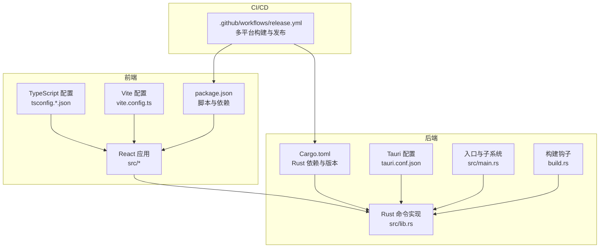
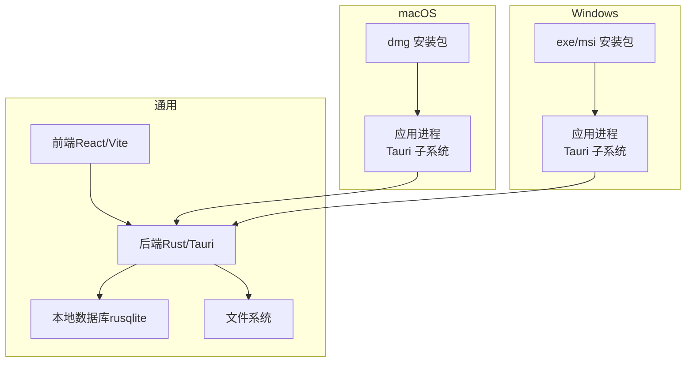
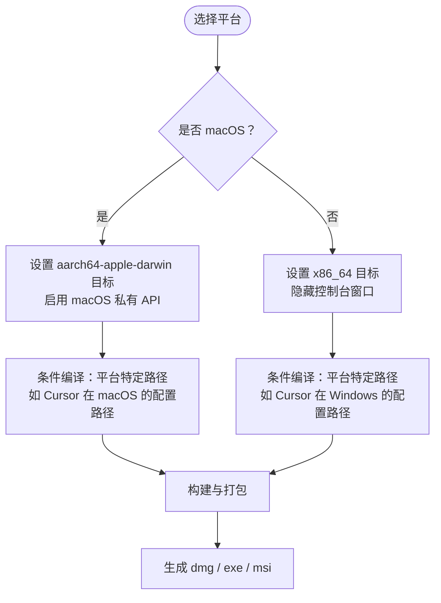
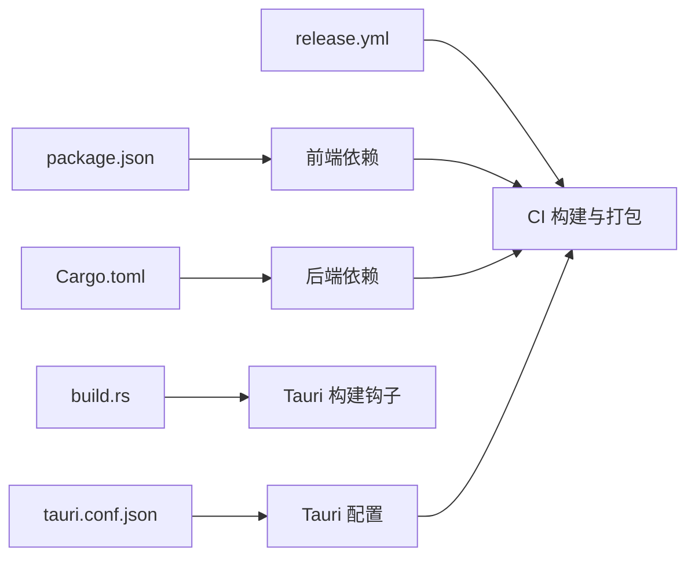

# 系统要求

<cite>
**本文引用的文件**
- [README.md](file://README.md)
- [package.json](file://package.json)
- [src-tauri/Cargo.toml](file://src-tauri/Cargo.toml)
- [src-tauri/tauri.conf.json](file://src-tauri/tauri.conf.json)
- [.github/workflows/release.yml](file://.github/workflows/release.yml)
- [src-tauri/src/lib.rs](file://src-tauri/src/lib.rs)
- [src-tauri/src/main.rs](file://src-tauri/src/main.rs)
- [vite.config.ts](file://vite.config.ts)
- [tsconfig.app.json](file://tsconfig.app.json)
- [tsconfig.node.json](file://tsconfig.node.json)
- [src-tauri/build.rs](file://src-tauri/build.rs)
</cite>

## 目录
1. [简介](#简介)
2. [项目结构](#项目结构)
3. [核心组件](#核心组件)
4. [架构总览](#架构总览)
5. [详细组件分析](#详细组件分析)
6. [依赖关系分析](#依赖关系分析)
7. [性能考虑](#性能考虑)
8. [故障排除指南](#故障排除指南)
9. [结论](#结论)
10. [附录](#附录)

## 简介
本文件面向最终用户，提供 AI 工具箱项目的系统要求与兼容性说明，涵盖操作系统与硬件要求、安装包类型与下载方式、兼容性测试与已知问题、第三方依赖与安装指导、跨平台开发技术实现与适配策略，以及安装前准备与常见问题排查建议。

## 项目结构
AI 工具箱采用前端（React + TypeScript + Vite）与后端（Rust + Tauri 2）结合的桌面应用架构。前端负责界面与交互，后端通过 Tauri 暴露命令接口并与系统文件系统交互；构建流程由 GitHub Actions 在 macOS 与 Windows 上自动打包发布。

**图表来源**
- [package.json:1-63](file://package.json#L1-L63)
- [tsconfig.app.json:1-37](file://tsconfig.app.json#L1-L37)
- [tsconfig.node.json:1-25](file://tsconfig.node.json#L1-L25)
- [vite.config.ts:1-31](file://vite.config.ts#L1-L31)
- [src-tauri/Cargo.toml:1-30](file://src-tauri/Cargo.toml#L1-L30)
- [src-tauri/tauri.conf.json:1-43](file://src-tauri/tauri.conf.json#L1-L43)
- [src-tauri/src/lib.rs:1-800](file://src-tauri/src/lib.rs#L1-L800)
- [src-tauri/src/main.rs:1-7](file://src-tauri/src/main.rs#L1-L7)
- [src-tauri/build.rs:1-4](file://src-tauri/build.rs#L1-L4)
- [.github/workflows/release.yml:1-59](file://.github/workflows/release.yml#L1-L59)

**章节来源**
- [README.md:1-119](file://README.md#L1-L119)
- [package.json:1-63](file://package.json#L1-L63)
- [src-tauri/Cargo.toml:1-30](file://src-tauri/Cargo.toml#L1-L30)
- [src-tauri/tauri.conf.json:1-43](file://src-tauri/tauri.conf.json#L1-L43)
- [.github/workflows/release.yml:1-59](file://.github/workflows/release.yml#L1-L59)

## 核心组件
- 前端框架与工具链
  - React 19 + TypeScript + Vite + Ant Design 6 + Monaco Editor
  - 代码分包策略：vendor（react/react-dom）、antd（antd/@ant-design/icons）、editor（monaco-editor/@monaco-editor/react）
- 后端框架与工具链
  - Rust 1.77.2 + Tauri 2（macOS 私有 API 开启）
  - 数据库 rusqlite（内置绑定），文件系统与事件监听 notify，路径与日志等基础能力
- 构建与发布
  - GitHub Actions 在 macOS 与 Windows 上并行构建，产物为 dmg（macOS）与 exe/msi（Windows）

**章节来源**
- [README.md:69-87](file://README.md#L69-L87)
- [package.json:29-61](file://package.json#L29-L61)
- [src-tauri/Cargo.toml:17-30](file://src-tauri/Cargo.toml#L17-L30)
- [src-tauri/tauri.conf.json:31-41](file://src-tauri/tauri.conf.json#L31-L41)
- [.github/workflows/release.yml:10-59](file://.github/workflows/release.yml#L10-L59)

## 架构总览
下图展示应用在不同平台上的运行与打包关系，以及前端与后端的交互边界。

**图表来源**
- [README.md:9-18](file://README.md#L9-L18)
- [src-tauri/tauri.conf.json:14-26](file://src-tauri/tauri.conf.json#L14-L26)
- [src-tauri/Cargo.toml:26-26](file://src-tauri/Cargo.toml#L26-L26)
- [.github/workflows/release.yml:18-23](file://.github/workflows/release.yml#L18-L23)

## 详细组件分析

### 操作系统与硬件要求
- 支持的操作系统
  - macOS：Apple Silicon（M 系列芯片）设备，使用 aarch64-apple-darwin 目标进行构建与签名
  - Windows：64 位（x86_64）系统，使用默认目标进行构建
- 硬件要求（建议）
  - CPU：现代多核处理器（Apple Silicon 或同等 x86_64 性能）
  - 内存：至少 4 GB RAM（推荐 8 GB+）
  - 存储：安装包体积较小，但技能与配置文件占用取决于用户数据规模
  - 显示：分辨率 1320x820 最小窗口尺寸（Windows），实际以显示器支持为准
- 兼容性测试与已知问题
  - 测试矩阵：macOS（aarch64-apple-darwin）与 Windows（x86_64）均通过 GitHub Actions 自动构建验证
  - 已知提示：macOS 若提示“无法打开”，可在系统设置中允许来自“未经公证的应用”的打开行为

**章节来源**
- [README.md:9-18](file://README.md#L9-L18)
- [.github/workflows/release.yml:18-23](file://.github/workflows/release.yml#L18-L23)
- [src-tauri/tauri.conf.json:17-20](file://src-tauri/tauri.conf.json#L17-L20)

### 安装包类型与下载方式
- 安装包类型
  - macOS：dmg（Apple Silicon）
  - Windows：exe 与 msi（64 位）
- 下载方式
  - 从项目 GitHub Releases 页面下载最新版本安装包
- 安装后位置（macOS）
  - 构建产物位于 src-tauri/target/release/bundle/dmg/（用于本地验证）

**章节来源**
- [README.md:9-18](file://README.md#L9-L18)
- [README.md:89-93](file://README.md#L89-L93)

### 第三方依赖与安装指导
- 前端依赖（示例）
  - React 生态、Ant Design UI、Monaco 编辑器、Zustand 状态管理
- 后端依赖（示例）
  - Tauri 2（含 macOS 私有 API）、rusqlite（内置绑定）、notify（文件系统监听）、dirs（用户目录）
- 构建与运行前置条件
  - Node.js 20（CI 使用版本）
  - Rust stable（CI 使用工具链）
  - macOS 使用 aarch64-apple-darwin 目标，Windows 使用默认 x86_64 目标
- 开发与运行
  - 安装依赖后执行开发模式或构建命令，详见快速开始章节

**章节来源**
- [package.json:29-61](file://package.json#L29-L61)
- [src-tauri/Cargo.toml:20-30](file://src-tauri/Cargo.toml#L20-L30)
- [.github/workflows/release.yml:29-38](file://.github/workflows/release.yml#L29-L38)
- [README.md:69-87](file://README.md#L69-L87)

### 跨平台开发的技术实现与适配策略
- 平台目标与编译
  - macOS：aarch64-apple-darwin 目标，启用 macOS 私有 API
  - Windows：默认 x86_64 目标，隐藏控制台窗口（发布时）
- 条件编译与平台路径
  - 后端根据 target_os 条件编译不同工具默认路径（如 Cursor 在 macOS 与 Windows 的配置路径不同）
- 前端打包与分包
  - Vite 手动分包策略，分离 vendor、antd、editor 三大块，优化加载与缓存
- Tauri 配置
  - Windows 窗口最小尺寸与透明装饰关闭，macOS 私有 API 开启

**图表来源**
- [.github/workflows/release.yml:18-23](file://.github/workflows/release.yml#L18-L23)
- [src-tauri/src/lib.rs:32-149](file://src-tauri/src/lib.rs#L32-L149)
- [src-tauri/src/main.rs:1-2](file://src-tauri/src/main.rs#L1-L2)
- [vite.config.ts:16-21](file://vite.config.ts#L16-L21)
- [src-tauri/tauri.conf.json:13-26](file://src-tauri/tauri.conf.json#L13-L26)

**章节来源**
- [.github/workflows/release.yml:18-23](file://.github/workflows/release.yml#L18-L23)
- [src-tauri/src/lib.rs:32-149](file://src-tauri/src/lib.rs#L32-L149)
- [src-tauri/src/main.rs:1-2](file://src-tauri/src/main.rs#L1-L2)
- [vite.config.ts:16-21](file://vite.config.ts#L16-L21)
- [src-tauri/tauri.conf.json:13-26](file://src-tauri/tauri.conf.json#L13-L26)

### 系统兼容性测试结果与已知问题
- 测试结果
  - macOS（Apple Silicon）与 Windows（x86_64）均通过 GitHub Actions 自动构建，产物上传至 Releases
- 已知问题
  - macOS 若出现“无法打开”提示，可在系统设置的“隐私与安全性”中允许来自“未经公证的应用”的打开行为

**章节来源**
- [.github/workflows/release.yml:10-59](file://.github/workflows/release.yml#L10-L59)
- [README.md:18-18](file://README.md#L18-L18)

### 安装前准备与兼容性检查清单
- macOS
  - 确认为 Apple Silicon 设备（M 系列芯片）
  - 关闭“无法打开”提示：系统设置 > 隐私与安全性 > 允许来自“未经公证的应用”的打开行为
- Windows
  - 确认为 64 位系统
  - 确保具备管理员权限（安装 exe/msi）
- 通用
  - 确认 Node.js 与 Rust 工具链可用（开发场景）
  - 确认网络可访问 GitHub Releases 下载安装包

**章节来源**
- [README.md:9-18](file://README.md#L9-L18)
- [.github/workflows/release.yml:29-38](file://.github/workflows/release.yml#L29-L38)

## 依赖关系分析
- 前端依赖
  - React、Ant Design、Monaco Editor、Zustand 等
- 后端依赖
  - Tauri、rusqlite、notify、dirs 等
- 构建与打包
  - Tauri CLI、Vite、TypeScript、ESLint/Prettier、Husky/Lint-Staged、Vitest（测试）

**图表来源**
- [package.json:29-61](file://package.json#L29-L61)
- [src-tauri/Cargo.toml:20-30](file://src-tauri/Cargo.toml#L20-L30)
- [src-tauri/tauri.conf.json:31-41](file://src-tauri/tauri.conf.json#L31-L41)
- [src-tauri/build.rs:1-4](file://src-tauri/build.rs#L1-L4)
- [.github/workflows/release.yml:10-59](file://.github/workflows/release.yml#L10-L59)

**章节来源**
- [package.json:29-61](file://package.json#L29-L61)
- [src-tauri/Cargo.toml:20-30](file://src-tauri/Cargo.toml#L20-L30)
- [src-tauri/tauri.conf.json:31-41](file://src-tauri/tauri.conf.json#L31-L41)
- [src-tauri/build.rs:1-4](file://src-tauri/build.rs#L1-L4)
- [.github/workflows/release.yml:10-59](file://.github/workflows/release.yml#L10-L59)

## 性能考虑
- 前端分包策略
  - 将 vendor、antd、editor 三类依赖拆分为独立 chunk，减少首屏加载体积与缓存命中成本
- 文件系统与数据库
  - 使用 rusqlite（内置绑定）与 notify（文件系统监听）提升本地数据与文件变更处理效率
- 构建与缓存
  - CI 使用 Rust 缓存与依赖缓存，缩短构建时间

**章节来源**
- [vite.config.ts:16-21](file://vite.config.ts#L16-L21)
- [src-tauri/Cargo.toml:26-26](file://src-tauri/Cargo.toml#L26-L26)
- [.github/workflows/release.yml:40-43](file://.github/workflows/release.yml#L40-L43)

## 故障排除指南
- macOS “无法打开”
  - 解决：系统设置 > 隐私与安全性 > 允许来自“未经公证的应用”的打开行为
- Windows 安装失败
  - 检查系统是否为 64 位，确保具备管理员权限
  - 如被安全软件拦截，临时关闭或添加白名单后重试
- 构建失败（开发/CI）
  - 确认 Node.js 与 Rust 工具链版本满足要求（Node.js 20、Rust stable）
  - 清理缓存后重试（npm ci、Rust 缓存清理）
- 前端依赖冲突
  - 使用 package-lock.json 固定版本，避免版本漂移导致的不一致

**章节来源**
- [README.md:18-18](file://README.md#L18-L18)
- [.github/workflows/release.yml:29-38](file://.github/workflows/release.yml#L29-L38)

## 结论
AI 工具箱在 macOS（Apple Silicon）与 Windows（x86_64）上具备完整的构建与发布链路，安装包类型与下载方式清晰明确。通过条件编译与平台路径适配，项目在不同平台上保持一致的功能体验。建议用户在安装前完成系统与权限检查，并参考故障排除指南解决常见问题。

## 附录
- 快速开始与构建命令
  - 安装依赖、开发模式、构建命令详见项目说明
- 版本与发布
  - 推送 v* 标签将触发自动构建与草稿发布；也可在 Actions 页面手动运行发布任务

**章节来源**
- [README.md:76-100](file://README.md#L76-L100)