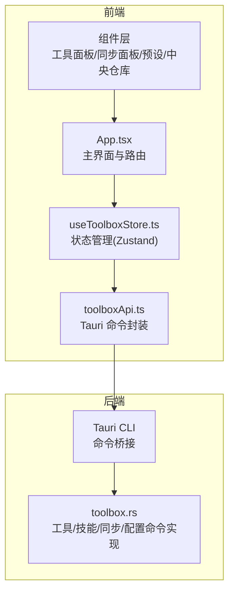
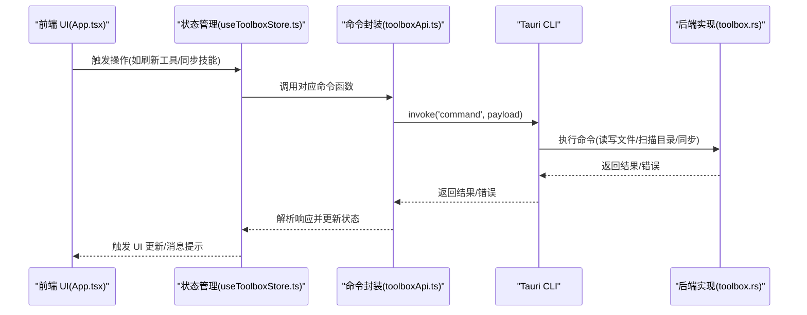
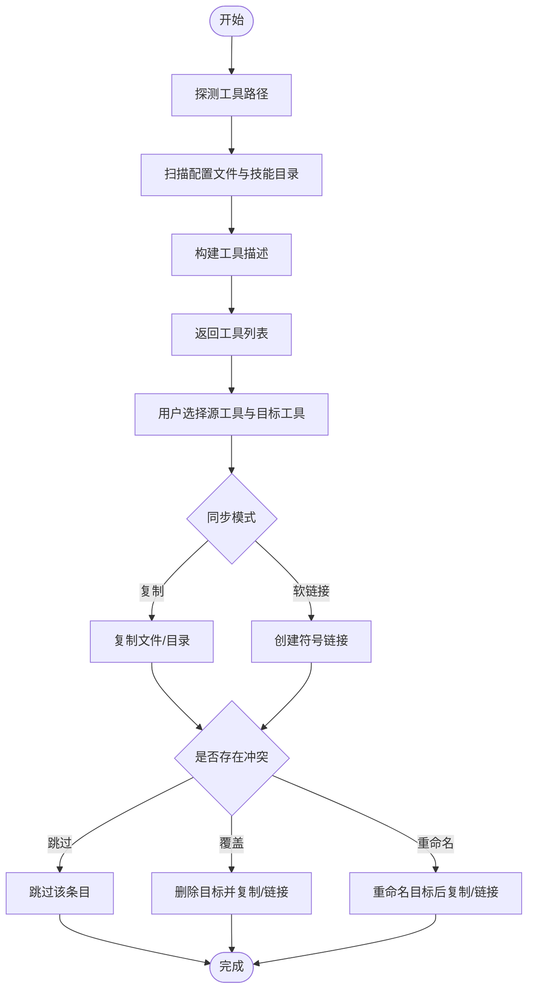
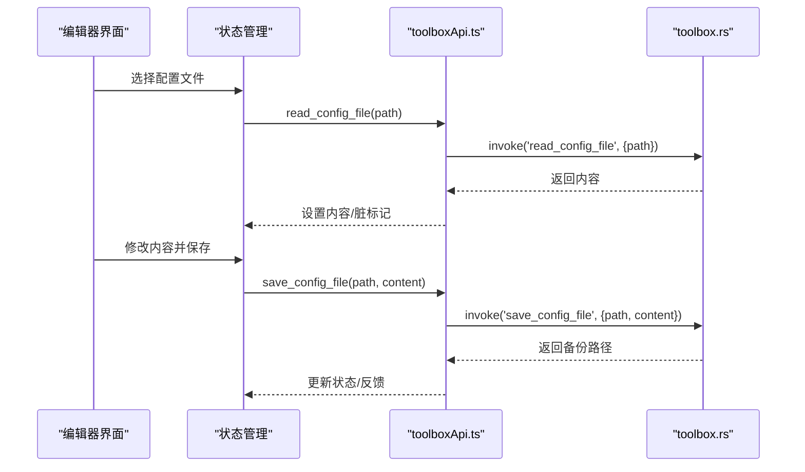
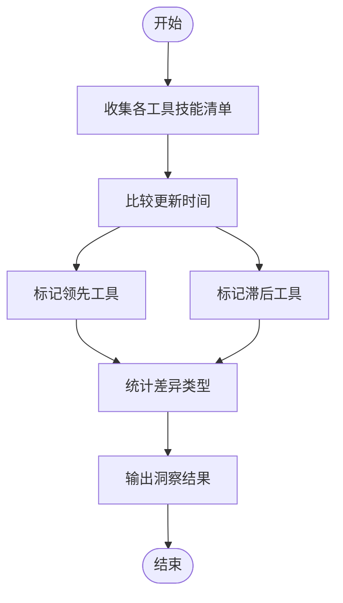
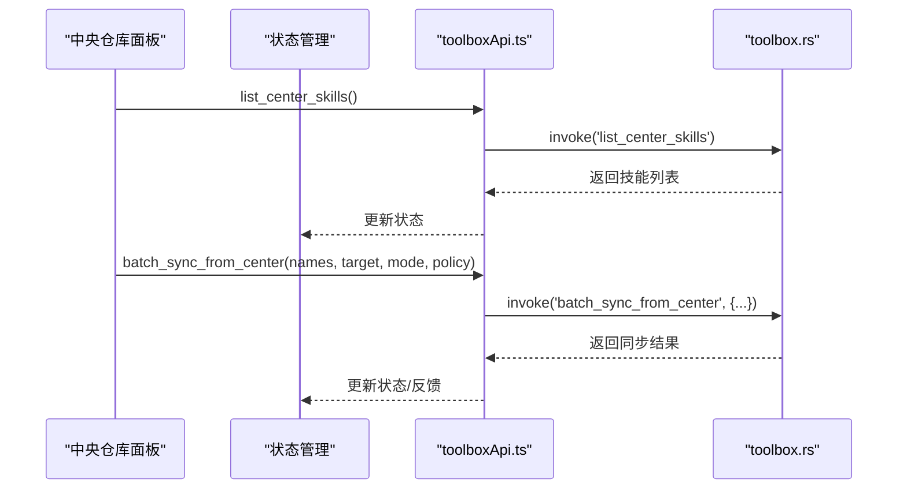
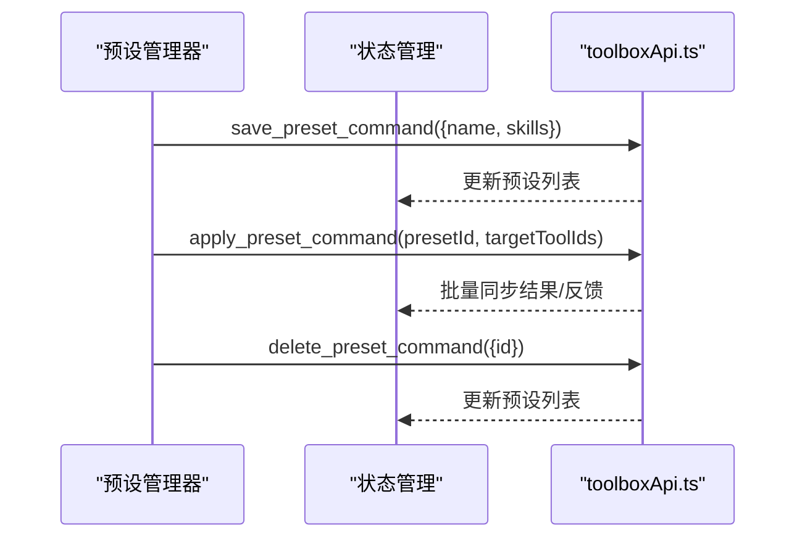
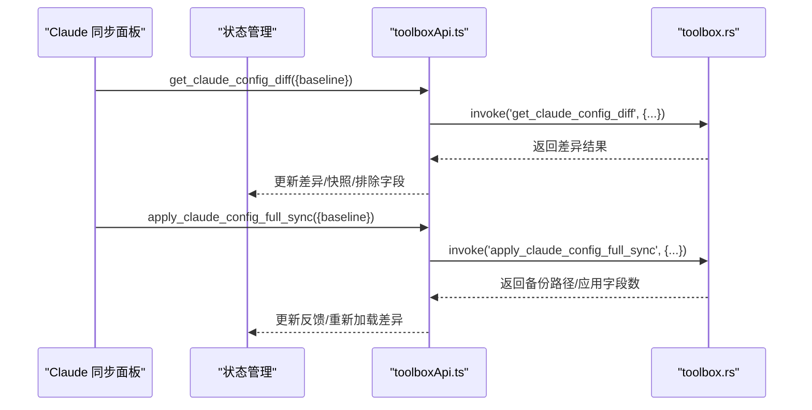
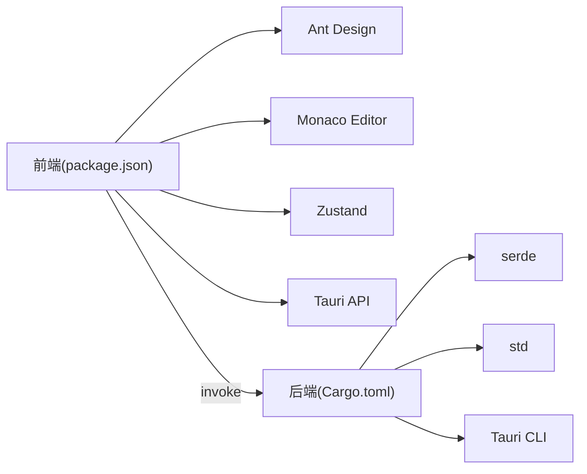

# 项目介绍

<cite>
**本文引用的文件**
- [README.md](file://README.md)
- [package.json](file://package.json)
- [AGENTS.md](file://AGENTS.md)
- [src/App.tsx](file://src/App.tsx)
- [src/main.tsx](file://src/main.tsx)
- [src/types/toolbox.ts](file://src/types/toolbox.ts)
- [src/store/useToolboxStore.ts](file://src/store/useToolboxStore.ts)
- [src/lib/toolboxApi.ts](file://src/lib/toolboxApi.ts)
- [src-tauri/src/toolbox.rs](file://src-tauri/src/toolbox.rs)
- [src-tauri/Cargo.toml](file://src-tauri/Cargo.toml)
- [src/components/CenterRepoPanel.tsx](file://src/components/CenterRepoPanel.tsx)
- [src/components/ClaudeConfigSyncPanel.tsx](file://src/components/ClaudeConfigSyncPanel.tsx)
- [src/components/PresetManager.tsx](file://src/components/PresetManager.tsx)
</cite>

## 目录
1. [简介](#简介)
2. [项目结构](#项目结构)
3. [核心组件](#核心组件)
4. [架构总览](#架构总览)
5. [详细组件分析](#详细组件分析)
6. [依赖关系分析](#依赖关系分析)
7. [性能考虑](#性能考虑)
8. [故障排查指南](#故障排查指南)
9. [结论](#结论)
10. [附录](#附录)

## 简介
AI 工具箱是一个基于 Tauri + React 的桌面端 Agent 技能管理工具，旨在帮助用户统一管理多个 AI Agent 工具（如 Claude、Cursor、Qoder、Trae、OpenCode、Agents 等）的配置文件与技能目录，并提供一键同步、变更洞察、配置编辑、预设管理与中央仓库等功能。其核心价值在于：
- 统一管理：集中注册与管理多工具，自动扫描工具目录与配置文件，支持启用/禁用切换。
- 跨工具同步：支持“复制”和“软链接”两种模式，提供“跳过/覆盖/重命名”三种冲突策略，实时展示同步状态。
- 配置编辑：内置 Monaco Editor，支持 JSON/YAML/TOML 等常见配置格式，具备自动保存与手动保存、备份与恢复能力。
- 变动洞察：实时监控各工具技能差异，识别领先工具与滞后工具，显示更新时间对比。
- 中央仓库：统一汇聚来自各工具的技能，支持从 Git 安装、批量导入、批量同步、分类标记与扫描发现。
- 预设管理：以技能集合为单位创建预设，一键应用到多个目标工具，提升批量配置效率。
- Claude 配置同步：针对 Claude 的 settings.json 与 cc-switch 公共配置进行差异比对与整段同步，支持快照基线与写锁提示。

适用场景与目标用户
- AI 开发者：需要在多个 Agent 工具间保持一致的技能与配置，减少重复劳动。
- 提示词工程师：需要集中管理提示词技能、统一版本与更新节奏。
- 工具运维人员：需要对多工具的配置进行统一编辑、备份与恢复。
- 团队协作：通过中央仓库与预设机制，标准化团队的技能与配置分发。

设计理念与用户体验
- 低门槛上手：提供工具注册向导、自动路径探测、一键刷新与同步，降低学习成本。
- 可视化反馈：通过状态栏、消息提示、差异统计与同步进度，让用户清晰掌握操作结果。
- 安全可控：支持备份、冲突策略与写锁提示，避免误操作造成配置丢失。
- 高效批量：支持批量导入、批量同步与预设应用，显著提升规模化配置效率。

开源协议、社区与贡献
- 协议：MIT
- 社区：通过 GitHub Releases 提供安装包，支持通过 Issues/PR 参与贡献。
- 贡献指南：遵循 AGENTS.md 中的开发规范与回滚安全规则，强调分支命名、变更同步与回滚前备份。

章节来源
- [README.md:1-119](file://README.md#L1-L119)
- [AGENTS.md:1-53](file://AGENTS.md#L1-L53)

## 项目结构
项目采用前后端分离架构：
- 前端（React + TypeScript + Ant Design + Monaco Editor + Zustand）负责 UI、状态管理与用户交互。
- 后端（Rust + Tauri 2）负责文件系统操作、工具与技能扫描、同步策略执行与 Claude 配置差异比对。
- 通过 Tauri 命令桥接前后端，暴露统一的命令接口。

图表来源
- [src/App.tsx:1-800](file://src/App.tsx#L1-L800)
- [src/store/useToolboxStore.ts:1-556](file://src/store/useToolboxStore.ts#L1-L556)
- [src/lib/toolboxApi.ts:1-784](file://src/lib/toolboxApi.ts#L1-L784)
- [src-tauri/src/toolbox.rs:1-814](file://src-tauri/src/toolbox.rs#L1-L814)

章节来源
- [README.md:44-67](file://README.md#L44-L67)
- [package.json:1-63](file://package.json#L1-L63)
- [src-tauri/Cargo.toml](file://src-tauri/Cargo.toml)

## 核心组件
- 工具注册与管理：支持自动探测工具路径、编辑配置文件、启用/禁用工具、删除工具。
- 技能同步：支持复制/软链接两种模式，冲突策略为跳过/覆盖/重命名，支持单个与批量同步。
- 配置编辑：内置 Monaco Editor，支持多种配置格式，具备自动保存与手动保存、备份与恢复。
- 变动洞察：计算领先与滞后工具，展示差异与更新时间对比。
- 中央仓库：统一汇聚技能、支持从 Git 安装、批量导入、批量同步、分类标记与扫描发现。
- 预设管理：以技能集合为单位创建预设，一键应用到多个目标工具。
- Claude 配置同步：差异比对 settings.json 与 cc-switch 公共配置，支持快照基线与整段同步。

章节来源
- [src/App.tsx:138-608](file://src/App.tsx#L138-L608)
- [src/store/useToolboxStore.ts:145-556](file://src/store/useToolboxStore.ts#L145-L556)
- [src/lib/toolboxApi.ts:387-784](file://src/lib/toolboxApi.ts#L387-L784)
- [src-tauri/src/toolbox.rs:219-400](file://src-tauri/src/toolbox.rs#L219-L400)

## 架构总览
AI 工具箱采用“前端 UI + 状态管理 + 命令封装 + 后端命令实现”的分层架构。前端通过 toolboxApi.ts 调用 Tauri 命令，后端在 Rust 中实现具体逻辑，包括工具扫描、技能目录遍历、同步策略、配置读写与备份、以及 Claude 配置差异比对。

图表来源
- [src/App.tsx:138-608](file://src/App.tsx#L138-L608)
- [src/store/useToolboxStore.ts:145-556](file://src/store/useToolboxStore.ts#L145-L556)
- [src/lib/toolboxApi.ts:387-784](file://src/lib/toolboxApi.ts#L387-L784)
- [src-tauri/src/toolbox.rs:219-400](file://src-tauri/src/toolbox.rs#L219-L400)

## 详细组件分析

### 工具与技能管理
- 工具注册：前端提供工具表单，支持 ID/名称/启用状态/配置文件/技能目录等字段；后端根据工具定义扫描配置文件与技能目录，返回工具描述。
- 技能目录：后端递归扫描技能目录，识别 SKILL.md 文件所在目录作为技能根，支持符号链接与重命名处理。
- 同步策略：支持复制与软链接两种模式，冲突策略包括跳过、覆盖与重命名；后端按入口类型（文件/目录/符号链接）分别处理。

图表来源
- [src/lib/toolboxApi.ts:521-604](file://src/lib/toolboxApi.ts#L521-L604)
- [src-tauri/src/toolbox.rs:297-400](file://src-tauri/src/toolbox.rs#L297-L400)

章节来源
- [src/App.tsx:351-472](file://src/App.tsx#L351-L472)
- [src/lib/toolboxApi.ts:521-604](file://src/lib/toolboxApi.ts#L521-L604)
- [src-tauri/src/toolbox.rs:297-400](file://src-tauri/src/toolbox.rs#L297-L400)

### 配置编辑与备份
- 编辑器：使用 Monaco Editor，支持多种语言高亮与自动保存。
- 读写：读取配置文件内容，保存时自动备份原文件，返回备份路径。
- 备份恢复：列出配置备份，支持按路径查询备份列表。

图表来源
- [src/store/useToolboxStore.ts:247-339](file://src/store/useToolboxStore.ts#L247-L339)
- [src/lib/toolboxApi.ts:407-436](file://src/lib/toolboxApi.ts#L407-L436)
- [src-tauri/src/toolbox.rs:226-295](file://src-tauri/src/toolbox.rs#L226-L295)

章节来源
- [src/store/useToolboxStore.ts:247-339](file://src/store/useToolboxStore.ts#L247-L339)
- [src/lib/toolboxApi.ts:407-436](file://src/lib/toolboxApi.ts#L407-L436)
- [src-tauri/src/toolbox.rs:226-295](file://src-tauri/src/toolbox.rs#L226-L295)

### 变动洞察与领先/滞后工具
- 洞察算法：遍历各工具技能，比较更新时间，识别领先工具与滞后工具，统计差异类型（新增/修改/删除）。
- 展示：在 UI 中以卡片形式展示每个技能的领先工具、滞后工具列表与差异详情。

图表来源
- [src/store/useToolboxStore.ts:207-217](file://src/store/useToolboxStore.ts#L207-L217)
- [src/lib/toolboxApi.ts:398-405](file://src/lib/toolboxApi.ts#L398-L405)
- [src/types/toolbox.ts:86-92](file://src/types/toolbox.ts#L86-L92)

章节来源
- [src/store/useToolboxStore.ts:207-217](file://src/store/useToolboxStore.ts#L207-L217)
- [src/lib/toolboxApi.ts:398-405](file://src/lib/toolboxApi.ts#L398-L405)
- [src/types/toolbox.ts:86-92](file://src/types/toolbox.ts#L86-L92)

### 中央仓库与批量操作
- 中央仓库：统一汇聚技能，支持从 Git 安装、扫描发现、导入到中央仓库、批量同步到工具、批量修改分类。
- 批量操作：支持批量同步、批量设置分类，提升规模化配置效率。

图表来源
- [src/components/CenterRepoPanel.tsx:99-120](file://src/components/CenterRepoPanel.tsx#L99-L120)
- [src/components/CenterRepoPanel.tsx:329-364](file://src/components/CenterRepoPanel.tsx#L329-L364)
- [src/lib/toolboxApi.ts:676-688](file://src/lib/toolboxApi.ts#L676-L688)
- [src-tauri/src/toolbox.rs:297-400](file://src-tauri/src/toolbox.rs#L297-L400)

章节来源
- [src/components/CenterRepoPanel.tsx:99-120](file://src/components/CenterRepoPanel.tsx#L99-L120)
- [src/components/CenterRepoPanel.tsx:329-364](file://src/components/CenterRepoPanel.tsx#L329-L364)
- [src/lib/toolboxApi.ts:676-688](file://src/lib/toolboxApi.ts#L676-L688)

### 预设管理
- 预设创建：选择技能集合，创建预设。
- 预设应用：选择目标工具，批量同步预设中的技能。
- 删除：支持删除预设。

图表来源
- [src/components/PresetManager.tsx:171-329](file://src/components/PresetManager.tsx#L171-L329)
- [src/store/useToolboxStore.ts:523-554](file://src/store/useToolboxStore.ts#L523-L554)
- [src/lib/toolboxApi.ts:734-750](file://src/lib/toolboxApi.ts#L734-L750)

章节来源
- [src/components/PresetManager.tsx:171-329](file://src/components/PresetManager.tsx#L171-L329)
- [src/store/useToolboxStore.ts:523-554](file://src/store/useToolboxStore.ts#L523-L554)
- [src/lib/toolboxApi.ts:734-750](file://src/lib/toolboxApi.ts#L734-L750)

### Claude 配置同步
- 差异比对：支持 live、richest 与快照三种基线，识别缺失、不一致、一致与仅 cc-switch 独有四类差异。
- 整段同步：将 settings.json 的非排除字段整体覆盖到 cc-switch 公共配置，写入前自动备份。
- 写锁提示：检测 cc-switch 写锁状态，提示用户先退出 GUI 再继续。

图表来源
- [src/components/ClaudeConfigSyncPanel.tsx:101-117](file://src/components/ClaudeConfigSyncPanel.tsx#L101-L117)
- [src/components/ClaudeConfigSyncPanel.tsx:150-153](file://src/components/ClaudeConfigSyncPanel.tsx#L150-L153)
- [src/lib/toolboxApi.ts:756-778](file://src/lib/toolboxApi.ts#L756-L778)
- [src-tauri/src/toolbox.rs:297-400](file://src-tauri/src/toolbox.rs#L297-L400)

章节来源
- [src/components/ClaudeConfigSyncPanel.tsx:101-117](file://src/components/ClaudeConfigSyncPanel.tsx#L101-L117)
- [src/components/ClaudeConfigSyncPanel.tsx:150-153](file://src/components/ClaudeConfigSyncPanel.tsx#L150-L153)
- [src/lib/toolboxApi.ts:756-778](file://src/lib/toolboxApi.ts#L756-L778)

## 依赖关系分析
- 前端依赖：React、Ant Design、Monaco Editor、Zustand、@tauri-apps/api。
- 后端依赖：Rust 生态（serde、std），Tauri 2 CLI。
- 命令接口：前端通过 toolboxApi.ts 的 invoke 调用后端命令，后端在 toolbox.rs 中实现具体逻辑。

图表来源
- [package.json:29-38](file://package.json#L29-L38)
- [src-tauri/Cargo.toml](file://src-tauri/Cargo.toml)

章节来源
- [package.json:1-63](file://package.json#L1-L63)
- [src-tauri/Cargo.toml](file://src-tauri/Cargo.toml)

## 性能考虑
- 文件系统操作：扫描技能目录与复制/链接操作可能受磁盘 I/O 影响，建议在批量同步时选择合适模式与冲突策略，避免不必要的重命名。
- UI 渲染：大量技能与配置文件的渲染可通过虚拟滚动与懒加载优化，减少首屏压力。
- 状态管理：Zustand 的细粒度状态更新有助于减少无关重渲染，建议按模块拆分状态与派发。
- 备份策略：保存配置时自动备份，避免频繁写入导致性能抖动，建议在大文件保存时提示用户。

## 故障排查指南
- 工具列表为空：检查工具注册项与技能目录是否存在，尝试刷新工具列表或重新注册工具。
- 同步失败：查看冲突策略与目标路径是否存在权限问题，必要时切换为覆盖或重命名策略。
- 配置保存失败：检查目标配置文件路径与父目录权限，确保有写入权限。
- Claude 同步失败：若提示 cc-switch 写锁，请先退出 cc-switch GUI 再继续；同时确认排除字段与快照基线设置正确。
- 预设应用失败：确认预设中技能名称与目标工具技能目录一致，检查批量同步结果与错误信息。

章节来源
- [src/store/useToolboxStore.ts:183-205](file://src/store/useToolboxStore.ts#L183-L205)
- [src/lib/toolboxApi.ts:407-436](file://src/lib/toolboxApi.ts#L407-L436)
- [src/components/ClaudeConfigSyncPanel.tsx:301-308](file://src/components/ClaudeConfigSyncPanel.tsx#L301-L308)

## 结论
AI 工具箱通过统一的工具注册、技能同步、配置编辑与中央仓库机制，有效解决了多 Agent 工具在技能与配置管理上的割裂问题。其简洁直观的 UI、完善的冲突策略与备份机制、以及 Claude 配置同步能力，使其成为 AI 开发者与提示词工程师提升效率与一致性的重要工具。配合预设与批量操作，团队协作与规模化配置也能高效完成。

## 附录
- 安装与下载：前往 GitHub Releases 获取最新安装包，按平台选择对应包体。
- 快速开始：安装依赖后运行开发模式或构建产物，支持 macOS 与 Windows 平台。
- 版本记录：包含 v0.1.0、v0.2.0、v0.2.1 等版本，持续迭代新增功能与改进体验。
- 分支说明：主分支为稳定版本，功能开发在特定分支进行，版本标签按 v* 格式发布。

章节来源
- [README.md:9-119](file://README.md#L9-L119)