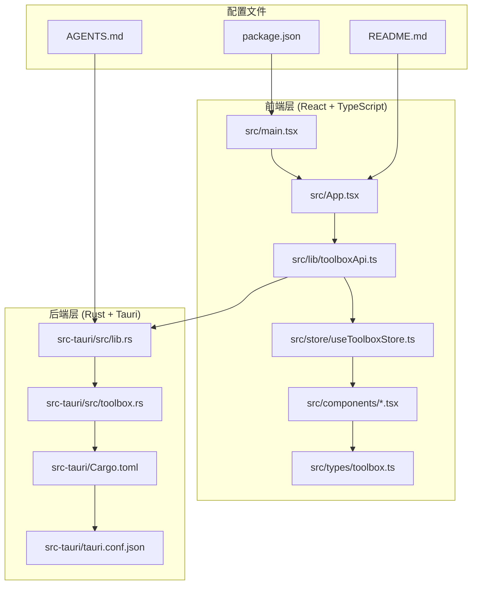
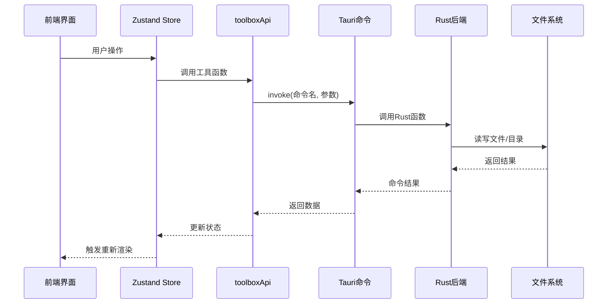
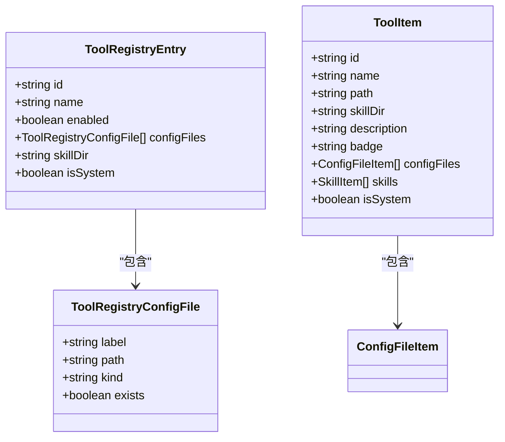
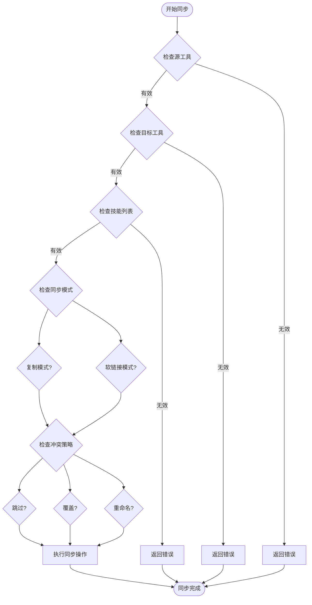
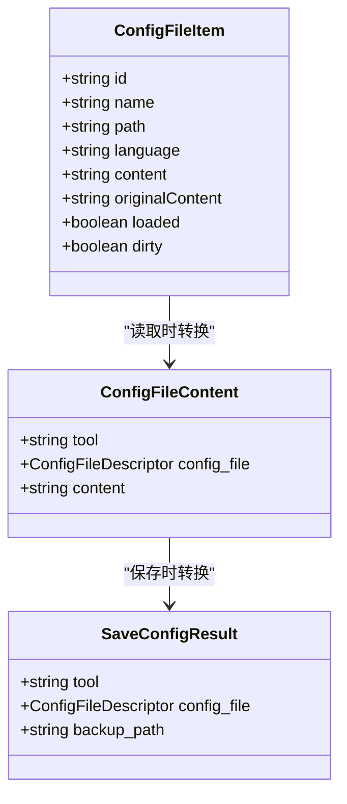
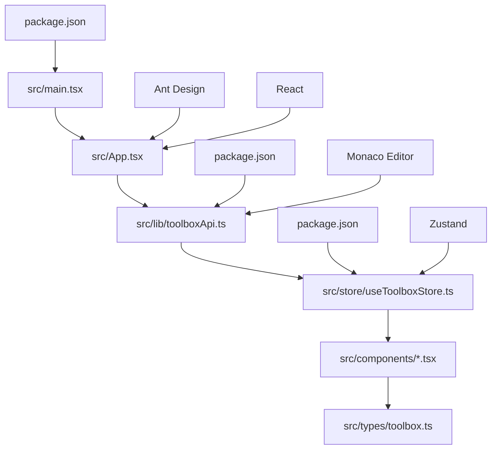
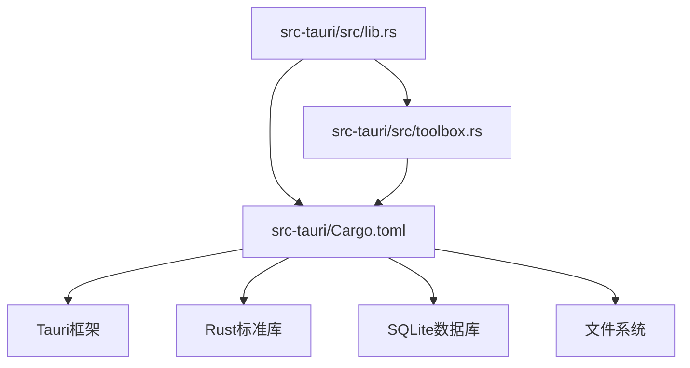

# 项目概述

<cite>
**本文档引用的文件**
- [README.md](file://README.md)
- [package.json](file://package.json)
- [src-tauri/Cargo.toml](file://src-tauri/Cargo.toml)
- [src-tauri/tauri.conf.json](file://src-tauri/tauri.conf.json)
- [src/App.tsx](file://src/App.tsx)
- [src/main.tsx](file://src/main.tsx)
- [src/lib/toolboxApi.ts](file://src/lib/toolboxApi.ts)
- [src/store/useToolboxStore.ts](file://src/store/useToolboxStore.ts)
- [src/types/toolbox.ts](file://src/types/toolbox.ts)
- [src-tauri/src/lib.rs](file://src-tauri/src/lib.rs)
- [src-tauri/src/toolbox.rs](file://src-tauri/src/toolbox.rs)
- [src/components/CenterRepoPanel.tsx](file://src/components/CenterRepoPanel.tsx)
- [src/components/ClaudeConfigSyncPanel.tsx](file://src/components/ClaudeConfigSyncPanel.tsx)
- [src/components/CommandPalette.tsx](file://src/components/CommandPalette.tsx)
- [AGENTS.md](file://AGENTS.md)
</cite>

## 目录
1. [项目简介](#项目简介)
2. [项目结构](#项目结构)
3. [核心组件](#核心组件)
4. [架构总览](#架构总览)
5. [详细组件分析](#详细组件分析)
6. [依赖关系分析](#依赖关系分析)
7. [性能考虑](#性能考虑)
8. [故障排查指南](#故障排查指南)
9. [结论](#结论)
10. [附录](#附录)

## 项目简介

AI 工具箱是一个基于 Tauri + React 的桌面端 Agent 技能管理工具，旨在帮助开发者统一管理本地 AI 开发工具的配置文件、技能目录，并实现跨工具的技能同步与配置对比。

### 核心价值主张
- **统一管理**：集中管理多种 AI 工具（如 Codex、Claude、Cursor 等）的配置文件与技能目录
- **智能同步**：支持物理复制与软链接两种同步模式，提供冲突处理策略
- **变更洞察**：实时监控各工具技能差异，识别领先与滞后的工具
- **中央仓库**：提供技能的中央存储与分发能力，支持从 Git 安装与批量同步
- **配置对比**：针对 Claude Code 提供专用的配置差异检测与整段同步功能

### 主要功能特性
- **工具管理**：多工具注册与管理，自动扫描工具目录，支持工具启用/禁用
- **技能同步**：一键同步技能到多个目标工具，支持软链接和物理复制模式
- **配置编辑**：内置 Monaco Editor 代码编辑器，支持多种配置格式
- **变动洞察**：实时监控各工具技能差异，识别领先工具与滞后工具
- **中央仓库**：技能的统一存储与分发，支持批量导入与同步
- **配置对比**：针对 Claude Code 的专用配置同步面板

### 应用场景
- 多工具开发者：同时使用多个 AI 开发工具的工程师
- 团队协作：需要在团队内标准化 AI 工具配置的开发团队
- 技能复用：希望在不同工具间共享和复用技能的开发者
- 配置管理：需要统一管理各类 AI 工具配置文件的开发者

## 项目结构

项目采用前后端分离架构，前端使用 React + TypeScript，后端使用 Rust + Tauri，通过 Tauri 命令系统进行通信。

**图表来源**
- [src/main.tsx:1-12](file://src/main.tsx#L1-L12)
- [src/App.tsx:1-800](file://src/App.tsx#L1-L800)
- [src-tauri/src/lib.rs:1-800](file://src-tauri/src/lib.rs#L1-L800)

### 目录组织特点
- **src/**：前端源码，按功能模块组织（components、lib、store、types）
- **src-tauri/**：后端 Rust 代码，包含 Tauri 命令实现与数据库操作
- **public/**：静态资源文件
- **docs/**：项目文档与截图资源

**章节来源**
- [README.md:44-67](file://README.md#L44-L67)
- [package.json:1-40](file://package.json#L1-L40)
- [src-tauri/Cargo.toml:1-29](file://src-tauri/Cargo.toml#L1-L29)

## 核心组件

### 前端核心组件

#### 应用入口与布局
- **App 组件**：应用主界面，负责工具列表展示、配置编辑、技能同步等功能
- **主入口**：src/main.tsx 负责渲染根组件

#### 状态管理
- **Zustand Store**：集中管理应用状态，包括工具数据、配置文件内容、同步状态等
- **工具状态**：维护当前选中的工具、配置文件、技能列表等

#### API 层
- **toolboxApi.ts**：封装所有 Tauri 命令调用，提供类型安全的接口
- **工具函数**：包含数据规范化、错误处理、Mock 数据支持

#### 类型定义
- **toolbox.ts**：定义所有数据结构和接口类型
- **类型安全**：确保前后端数据传输的一致性和完整性

**章节来源**
- [src/App.tsx:1-800](file://src/App.tsx#L1-L800)
- [src/main.tsx:1-12](file://src/main.tsx#L1-L12)
- [src/store/useToolboxStore.ts:1-609](file://src/store/useToolboxStore.ts#L1-L609)
- [src/lib/toolboxApi.ts:1-760](file://src/lib/toolboxApi.ts#L1-L760)
- [src/types/toolbox.ts:1-155](file://src/types/toolbox.ts#L1-L155)

### 后端核心组件

#### Tauri 命令实现
- **lib.rs**：定义所有 Tauri 命令，包括工具管理、配置读写、技能同步等
- **命令注册**：通过 #[tauri::command] 宏自动注册 Rust 函数为 Tauri 命令

#### 数据模型
- **toolbox.rs**：定义工具描述符、配置文件描述符、技能条目等数据结构
- **类型转换**：提供前后端数据结构之间的映射和转换

#### 工具配置
- **工具规格**：内置多种 AI 工具的配置规格（Codex、Claude、Cursor 等）
- **路径检测**：自动检测工具的配置文件和技能目录位置

**章节来源**
- [src-tauri/src/lib.rs:1-800](file://src-tauri/src/lib.rs#L1-L800)
- [src-tauri/src/toolbox.rs:1-800](file://src-tauri/src/toolbox.rs#L1-L800)

## 架构总览

AI 工具箱采用现代化的桌面应用架构，结合了前端框架的响应式特性和后端语言的安全性。

**图表来源**
- [src/lib/toolboxApi.ts:1-760](file://src/lib/toolboxApi.ts#L1-L760)
- [src-tauri/src/lib.rs:513-800](file://src-tauri/src/lib.rs#L513-L800)

### 技术架构设计原则

#### 前后端分离
- **职责清晰**：前端负责用户交互和状态管理，后端负责文件系统操作和业务逻辑
- **类型安全**：通过 TypeScript 和 Rust 的类型系统确保数据一致性
- **异步通信**：使用 Tauri 的 invoke 机制进行异步命令调用

#### 跨平台支持
- **Tauri 框架**：基于 Web 技术构建，支持 Windows、macOS、Linux
- **原生能力**：通过 Rust 插件访问系统文件系统、进程等原生功能
- **窗口管理**：支持自定义窗口样式和拖拽功能

#### 数据流设计
- **单向数据流**：状态变更通过 Store 集中管理，避免状态竞争
- **响应式更新**：组件订阅 Store 变化，自动重新渲染
- **错误边界**：完善的错误处理和反馈机制

**章节来源**
- [src-tauri/tauri.conf.json:1-42](file://src-tauri/tauri.conf.json#L1-L42)
- [package.json:14-23](file://package.json#L14-L23)

## 详细组件分析

### 工具管理组件

#### 工具注册与配置

**图表来源**
- [src/types/toolbox.ts:65-72](file://src/types/toolbox.ts#L65-L72)
- [src/types/toolbox.ts:58-63](file://src/types/toolbox.ts#L58-L63)
- [src/types/toolbox.ts:33-43](file://src/types/toolbox.ts#L33-L43)

#### 工具路径检测
- **智能检测**：根据工具名称自动匹配配置文件和技能目录路径
- **存在性验证**：检查路径是否存在，动态更新配置文件状态
- **默认配置**：提供内置的工具规格定义

**章节来源**
- [src-tauri/src/lib.rs:249-329](file://src-tauri/src/lib.rs#L249-L329)
- [src/lib/toolboxApi.ts:585-607](file://src/lib/toolboxApi.ts#L585-L607)

### 技能同步组件

#### 同步策略

**图表来源**
- [src-tauri/src/lib.rs:489-511](file://src-tauri/src/lib.rs#L489-L511)
- [src-tauri/src/lib.rs:437-474](file://src-tauri/src/lib.rs#L437-L474)

#### 冲突处理策略
- **跳过 (Skip)**：遇到冲突时直接跳过该文件
- **覆盖 (Overwrite)**：删除目标文件后重新写入
- **重命名 (Rename)**：为目标文件添加时间戳后缀

#### 同步模式
- **复制模式 (Copy)**：完整复制文件内容
- **软链接模式 (Symlink)**：创建符号链接引用源文件

**章节来源**
- [src-tauri/src/lib.rs:489-511](file://src-tauri/src/lib.rs#L489-L511)
- [src/lib/toolboxApi.ts:446-473](file://src/lib/toolboxApi.ts#L446-L473)

### 配置编辑组件

#### Monaco Editor 集成
- **语法高亮**：支持 JSON、YAML、TOML、Markdown 等多种语言
- **自动保存**：支持自动保存和手动保存两种模式
- **备份机制**：自动创建配置文件备份，支持版本回溯

#### 配置文件管理

**图表来源**
- [src/types/toolbox.ts:22-31](file://src/types/toolbox.ts#L22-L31)
- [src/types/toolbox.ts:64-72](file://src/types/toolbox.ts#L64-L72)

**章节来源**
- [src/lib/toolboxApi.ts:411-444](file://src/lib/toolboxApi.ts#L411-L444)
- [src-tauri/src/toolbox.rs:228-292](file://src-tauri/src/toolbox.rs#L228-L292)

### 中央仓库组件

#### 技能管理
- **技能发现**：扫描各工具中的技能，自动发现可导入的技能
- **批量操作**：支持批量导入、批量同步、批量分类标记
- **分类管理**：支持自定义、市场、系统三种分类

#### Git 集成
- **从 Git 安装**：支持从 Git 仓库直接安装技能到中央仓库
- **版本控制**：通过 Git 管理技能的版本和更新

**章节来源**
- [src/components/CenterRepoPanel.tsx:1-812](file://src/components/CenterRepoPanel.tsx#L1-L812)
- [src/lib/toolboxApi.ts:635-707](file://src/lib/toolboxApi.ts#L635-L707)

### Claude 配置同步组件

#### 配置对比
- **字段级对比**：逐字段比较 settings.json 和 cc-switch 的配置差异
- **基线选择**：支持 Live、Richest、Snapshot 三种基线模式
- **差异类型**：识别缺失、不一致、一致、仅 cc-switch 独有四种差异类型

#### 整段同步
- **覆盖策略**：将 settings.json 的配置整段覆盖到 cc-switch
- **备份机制**：同步前自动创建备份，支持错误回滚
- **排除字段**：某些 provider 私有字段不参与对比和同步

**章节来源**
- [src/components/ClaudeConfigSyncPanel.tsx:1-420](file://src/components/ClaudeConfigSyncPanel.tsx#L1-L420)
- [src/lib/toolboxApi.ts:739-760](file://src/lib/toolboxApi.ts#L739-L760)

## 依赖关系分析

### 前端依赖关系

**图表来源**
- [package.json:14-23](file://package.json#L14-L23)
- [src/main.tsx:1-12](file://src/main.tsx#L1-L12)

### 后端依赖关系

**图表来源**
- [src-tauri/Cargo.toml:20-29](file://src-tauri/Cargo.toml#L20-L29)
- [src-tauri/src/lib.rs:1-16](file://src-tauri/src/lib.rs#L1-L16)

### 关键依赖说明

#### 前端核心依赖
- **React 19**：现代 React 版本，提供更好的性能和开发体验
- **Ant Design 6**：企业级 UI 组件库，提供丰富的界面组件
- **Monaco Editor**：VS Code 同款编辑器，提供强大的代码编辑能力
- **Zustand**：轻量级状态管理库，替代 Redux 的现代方案

#### 后端核心依赖
- **Tauri 2**：现代化桌面应用框架，提供跨平台支持
- **Rust**：系统级编程语言，保证内存安全和执行效率
- **SQLite**：嵌入式数据库，用于存储应用配置和元数据
- **notify**：文件系统监控，实现实时技能变更检测

**章节来源**
- [package.json:14-38](file://package.json#L14-L38)
- [src-tauri/Cargo.toml:20-29](file://src-tauri/Cargo.toml#L20-L29)

## 性能考虑

### 前端性能优化

#### 状态管理优化
- **选择性订阅**：组件只订阅需要的状态，减少不必要的重新渲染
- **状态分片**：将大对象拆分为小的独立状态，提高更新效率
- **缓存策略**：对计算结果进行缓存，避免重复计算

#### 渲染性能
- **虚拟滚动**：大量技能列表使用虚拟滚动，只渲染可见区域
- **懒加载**：组件按需加载，减少初始包体积
- **防抖节流**：对高频操作（如搜索、输入）使用防抖节流

#### 数据处理
- **增量更新**：只更新发生变化的数据，避免全量重绘
- **批处理**：将多个状态更新合并为一次批处理

### 后端性能优化

#### 文件操作优化
- **并发处理**：利用 Rust 的并发特性处理多个文件操作
- **内存映射**：大文件使用内存映射减少内存占用
- **增量扫描**：只扫描发生变化的目录，避免全量扫描

#### 数据库优化
- **索引优化**：为常用查询字段建立索引
- **连接池**：使用连接池复用数据库连接
- **事务处理**：批量操作使用事务，保证数据一致性

### 内存管理

#### 前端内存管理
- **垃圾回收**：合理使用 React hooks，避免内存泄漏
- **资源释放**：及时清理定时器、事件监听器等资源
- **图片优化**：压缩和懒加载图片资源

#### 后端内存管理
- **所有权系统**：利用 Rust 的所有权系统避免内存泄漏
- **零拷贝**：尽可能使用零拷贝操作处理数据
- **资源池**：复用昂贵的资源对象

## 故障排查指南

### 常见问题诊断

#### 启动问题
- **检查依赖安装**：确保 npm install 正常完成
- **查看控制台错误**：检查浏览器开发者工具的错误信息
- **权限问题**：确认应用具有访问配置文件和技能目录的权限

#### 同步失败
- **检查路径有效性**：确认源工具和目标工具的路径都存在
- **权限检查**：确认应用有写入目标目录的权限
- **磁盘空间**：检查目标磁盘是否有足够空间

#### 配置读取失败
- **文件格式**：确认配置文件格式正确（JSON、YAML、TOML）
- **编码问题**：检查文件编码是否为 UTF-8
- **备份恢复**：使用备份功能恢复到上一个正常状态

### 调试技巧

#### 前端调试
- **Redux DevTools**：使用浏览器扩展观察状态变化
- **React DevTools**：检查组件树和 props 变化
- **网络面板**：监控 Tauri 命令调用的网络请求

#### 后端调试
- **日志输出**：通过 Tauri 日志系统查看 Rust 代码执行情况
- **断点调试**：使用 VS Code 的 Rust 调试功能
- **单元测试**：编写测试用例验证核心功能

### 错误处理机制

#### 前端错误处理
- **全局错误边界**：捕获组件渲染错误
- **API 错误处理**：统一处理 Tauri 命令调用错误
- **用户反馈**：通过消息提示和模态框告知用户错误信息

#### 后端错误处理
- **Result 类型**：使用 Rust 的 Result 类型处理可能失败的操作
- **错误传播**：将错误信息传递给前端进行用户展示
- **日志记录**：记录详细的错误日志便于调试

**章节来源**
- [src/store/useToolboxStore.ts:202-225](file://src/store/useToolboxStore.ts#L202-L225)
- [src/lib/toolboxApi.ts:411-444](file://src/lib/toolboxApi.ts#L411-L444)

## 结论

AI 工具箱是一个设计精良的桌面端 Agent 技能管理工具，通过现代化的技术栈实现了跨平台、高性能、易用的用户体验。项目的主要优势包括：

### 技术优势
- **架构清晰**：前后端分离架构，职责明确，易于维护和扩展
- **性能优秀**：利用 Rust 的系统级性能和 React 的响应式特性
- **跨平台支持**：基于 Tauri 框架，支持 Windows、macOS、Linux

### 功能特色
- **智能同步**：提供多种同步模式和冲突处理策略
- **变更洞察**：实时监控技能差异，帮助用户保持工具一致性
- **中央仓库**：统一管理技能，支持批量操作和分类管理

### 发展前景
项目已经具备稳定的架构基础和完整的功能特性，未来可以在以下方面进一步发展：
- **插件生态**：扩展更多 AI 工具的支持
- **云端同步**：增加云端备份和同步功能
- **团队协作**：增强团队共享和权限管理功能

## 附录

### 系统要求

#### 最低系统要求
- **Windows**：Windows 10 或更高版本
- **macOS**：macOS 10.15 或更高版本
- **Linux**：支持大多数主流发行版

#### 运行时依赖
- **Node.js**：版本 16 或更高
- **Rust**：版本 1.77.2 或更高
- **npm**：版本 8 或更高

#### 硬件要求
- **内存**：至少 4GB RAM
- **存储**：至少 500MB 可用空间
- **CPU**：现代 x86_64 或 ARM64 处理器

### 兼容性说明

#### 浏览器兼容性
- **Chrome**：最新两个版本
- **Firefox**：最新两个版本  
- **Safari**：macOS 10.15+ 的最新版本
- **Edge**：基于 Chromium 的最新版本

#### AI 工具兼容性
- **Codex**：完全支持
- **Claude**：完全支持，包含配置同步功能
- **Cursor**：完全支持
- **Qoder**：完全支持
- **Trae**：完全支持
- **OpenCode**：完全支持
- **Agents**：完全支持

### 许可证信息

项目采用 MIT 许可证，允许自由使用、修改和分发，但需保留版权声明和许可声明。

**章节来源**
- [README.md:116-119](file://README.md#L116-L119)
- [package.json:1-40](file://package.json#L1-L40)